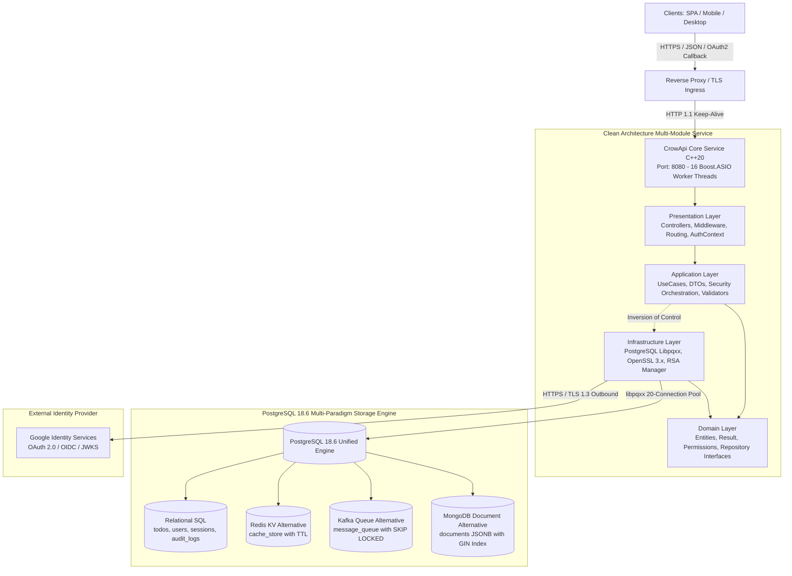

# CrowApi - Enterprise Modern C++20 REST API

[](https://en.cppreference.com/w/cpp/20)
[](https://www.postgresql.org/)
[](https://crowcpp.org/)
[](https://www.openssl.org/)
[](#automated-testing-suite)
[](LICENSE)

An enterprise-grade, high-throughput REST API backend built in **Modern ISO C++20** with the **Crow Microframework** (Boost.ASIO), **OpenSSL 3.x**, and **PostgreSQL 18.6** as a unified **4-in-1 Multi-Paradigm Engine** (Relational SQL, Redis-style KV Cache, Kafka-style Message Queue, and MongoDB-style JSONB Document Store).

Includes a production-hardened **Identity & Multi-Session Subsystem** featuring **Google OAuth 2.0 / OIDC with RFC 7636 PKCE S256**, **Bidirectional Account Linking**, **RS256 JWTs with JWKS discovery**, **Refresh Token Rotation**, and real-time session revocation via PostgreSQL `LISTEN / NOTIFY`.

---

## Architecture at a Glance



---

## Detailed Documentation Suite

Deep technical design documents, database schemas, flowcharts, and testing specifications are available in the **[`docs/`](docs/README.md)** directory:

| Document | Description |
| :--- | :--- |
| **[01. System Design](docs/01_system_design.md)** | High-level system design, ASIO reactor threading model, connection pooling, OpenSSL thread safety, and deployment topologies. |
| **[02. Software Architecture](docs/02_architecture.md)** | Detailed architecture overview, component interactions, and interface definitions. |
| **[03. Clean Layer Architecture](docs/clean_architecture.md)** | Deep dive into the 5 Clean Architecture layers, C++20 concepts, compilation firewalls, and dependency inversion flows. |
| **[04. Security Architecture](docs/security.md)** | Complete security manual: threat mitigation matrix, middleware pipeline, JWT lifecycle, key rotation, and real-time revocations. |
| **[05. Database Design](docs/03_database_design.md)** | PostgreSQL 18.6 4-in-1 multi-paradigm engine, ER diagrams, schemas, HOT fillfactor tuning, and GIN `jsonb_path_ops` indexing. |
| **[06. API & Auth Flows](docs/04_api_flows.md)** | Sequence diagrams for Local Login, Google OAuth2 PKCE S256, Refresh Token Rotation, Account Linking, and Multi-Paradigm APIs. |
| **[07. Test Design & Strategy](docs/05_test_design.md)** | Detailed test strategy explaining *why* we test, *what* scenarios are covered across all 68 automated tests, and cyber-attack defense verifications. |

---

## Core Capabilities

### 1. Google OAuth 2.0 / OIDC with RFC 7636 PKCE S256
- **Proof Key for Code Exchange (PKCE)**: Eliminates authorization code interception attacks using OpenSSL CSPRNG 64-character verifiers and SHA-256 base64url-encoded challenges. Verified against RFC 7636 Appendix B test vectors.
- **Single-Use Replay Protection**: CSRF `state` and `code_verifier` are cached in PostgreSQL `cache_store` with 600s TTL and **immediately evicted** upon token exchange.
- **Dual Flow Support**:
  - Server-assisted flow (`GET /api/v1/auth/google/url` -> `GET /api/v1/auth/google/callback`).
  - Client-side flow (`POST /api/v1/auth/google`) for mobile apps or SPAs generating their own PKCE verifiers.

### 2. Bidirectional Account Linking
- **Local to Google**: An existing user registered with email/password who subsequently signs in via Google with matching email automatically links their `google_id` and avatar URL (`auth_provider = 'local+google'`).
- **Google to Local**: A user registering exclusively through Google (`password_hash = NULL`) can set a local password via `POST /api/v1/auth/set-password` and subsequently sign in with **both** methods interchangeably.

### 3. Pure Stateless RS256 JWT Authentication & Multi-Sessions
- **Asymmetric RS256 Signing**: JWTs signed with RSA 2048-bit keys managed by `RsaKeyManager`.
- **Public JWKS Discovery**: RFC 7517 compliant JSON Web Key Set at `GET /.well-known/jwks.json` enabling external API gateways and microservices to verify tokens without sharing private keys.
- **Refresh Token Rotation**: Refresh tokens are one-time use. Submitting a previously rotated token triggers an automatic security alert and **revokes all active sessions** in the family.
- **Multi-Device Session Registry**: Inspect active sessions (`GET /api/v1/sessions`), revoke specific devices, or revoke all sessions cluster-wide.
- **Real-Time Revocation**: PostgreSQL `LISTEN/NOTIFY` on channel `session_revoked` triggers instantaneous memory cache invalidation across distributed nodes.
- **Brute-Force Lockout**: 5 consecutive failed login attempts lock the account for 15 minutes (`locked_until`).

### 4. PostgreSQL 18.6 4-in-1 Multi-Paradigm Engine
Consolidates four distinct storage paradigms into a single PostgreSQL 18.6 cluster:
- **Relational SQL**: ACID CRUD tasks on `todos`.
- **Redis KV Cache Alternative**: High-speed key-value cache with sliding/absolute TTL on `cache_store`.
- **Kafka Message Queue Alternative**: Concurrent transactional queue polling with `FOR UPDATE SKIP LOCKED` on `message_queue`.
- **MongoDB Document DB Alternative**: Schemaless `JSONB` storage with `jsonb_path_ops` GIN indexing on `documents`.

### 5. High-Performance Engineering & Clean Architecture
- **Heap-Only Tuples (HOT)**: Tables with frequent updates use `fillfactor = 85` (`sessions`, `cache_store`) and `fillfactor = 80` (`message_queue`), leaving page headroom to update records in-place without touching indexes.
- **Strict Separation of Concerns**: Codebase divided into `Domain`, `Application`, `Infrastructure`, `Presentation`, and `Core` CMake modules.
- **Zero Warnings, Zero Errors**: Compiles cleanly with MSVC / Clang under strict C++20 `/permissive-` flags.

---

## API Endpoints Reference

### Authentication & Identity
| Method | Endpoint | Description | Auth Required |
| :--- | :--- | :--- | :--- |
| `POST` | `/api/v1/auth/register` | Register new user with email and password | No |
| `POST` | `/api/v1/auth/login` | Local login (issues RS256 JWT & refresh token) | No |
| `GET` | `/api/v1/auth/google/url` | Generate Google OAuth2 authorization URL with PKCE | No |
| `GET` | `/api/v1/auth/google/callback` | Google OAuth2 redirect callback with PKCE exchange | No |
| `POST` | `/api/v1/auth/google` | Direct Google token exchange with client PKCE verifier | No |
| `POST` | `/api/v1/auth/set-password` | Set password on Google-registered account (Dual Auth) | **Bearer JWT** |
| `POST` | `/api/v1/auth/refresh` | Refresh token rotation (issues new JWT & refresh token) | No |
| `POST` | `/api/v1/auth/logout` | Revoke current device session and ban JWT `jti` | **Bearer JWT** |
| `POST` | `/api/v1/auth/logout-all` | Revoke all active sessions across all devices | **Bearer JWT** |
| `GET` | `/.well-known/jwks.json` | Public RSA keys in RFC 7517 JWKS format | No |

### Session Management
| Method | Endpoint | Description | Auth Required |
| :--- | :--- | :--- | :--- |
| `GET` | `/api/v1/sessions` | List authenticated user's active device sessions | **Bearer JWT** |
| `DELETE` | `/api/v1/sessions/<id>` | Revoke specific device session (bans its `jti`) | **Bearer JWT** |
| `GET` | `/api/v1/admin/sessions` | Admin: List all sessions with user and IP filters | **Admin JWT** |
| `DELETE` | `/api/v1/admin/sessions/<id>` | Admin: Force revoke specific session | **Admin JWT** |
| `POST` | `/api/v1/admin/users/<id>/sessions/revoke-all` | Admin: Force revoke all sessions for a user | **Admin JWT** |

### Multi-Paradigm Data Engine
| Engine | Method | Endpoint | Description |
| :--- | :--- | :--- | :--- |
| **Relational SQL** | `GET` / `POST` | `/api/todos` | List or create todos |
| **Relational SQL** | `GET` / `PUT` / `DELETE` | `/api/todos/<id>` | Get, update, or delete a todo |
| **Redis KV Cache** | `GET` / `POST` / `DELETE` | `/api/cache/<key>` | Read, set with TTL, or delete cache entry |
| **Redis KV Cache** | `POST` | `/api/cache/cleanup` | Trigger purge of expired cache keys |
| **Kafka Queue** | `POST` | `/api/queue/publish` | Enqueue message to topic with JSONB payload |
| **Kafka Queue** | `POST` | `/api/queue/poll` | Drain pending messages via `FOR UPDATE SKIP LOCKED` |
| **Kafka Queue** | `POST` | `/api/queue/ack/<id>` | Acknowledge completed message |
| **Kafka Queue** | `POST` | `/api/queue/fail/<id>` | Mark message as failed for retry |
| **Kafka Queue** | `GET` | `/api/queue/metrics` | Inspect queue depth and status distribution |
| **MongoDB JSONB** | `POST` | `/api/documents/<col>` | Store schemaless JSON document |
| **MongoDB JSONB** | `GET` / `PUT` / `DELETE` | `/api/documents/<col>/<id>` | Retrieve, update, or remove document |
| **MongoDB JSONB** | `POST` | `/api/documents/<col>/query` | Query collection via `@>` containment with GIN index |

### System & Documentation
| Method | Endpoint | Description |
| :--- | :--- | :--- |
| `GET` | `/health`, `/api/health` | Health check & uptime metrics |
| `GET` | `/docs` | Interactive Swagger UI API documentation |
| `GET` | `/api/openapi.json` | OpenAPI 3.1 schema specification |

---

## Automated Testing Suite

CrowApi features a custom, zero-dependency, high-speed test harness asserting **68 automated tests** across **14 categories** with **435 assertions** executing in **~3.2 seconds**:

```powershell
.\out\build\x64-debug\Tests\Tests.exe
```

```text
=================================================================
  CrowApi Comprehensive Multi-Layer Test Suite                    
  Environment  : .env.test (PostgreSQL 18.6 + OpenSSL 3.x)         
  Total Tests  : 68
=================================================================
--- [Domain::Result] ---
  [PASS] SuccessResultHoldsValue (8 us)
  [PASS] FailureResultHoldsError (5 us)
--- [Domain::Permissions] ---
  [PASS] RoleHierarchyAndPermissions (13 us)
--- [Domain::Entities] ---
  [PASS] TodoValidationAndProperties (2 us)
  [PASS] UserEntityInvariants (6 us)
  [PASS] SessionEntityProperties (5 us)
  [PASS] AuditLogCreation (3 us)
--- [Application::Validation] ---
  [PASS] TodoInputValidatorSuccess (26 us)
  [PASS] TodoInputValidatorEmptyTitle (23 us)
  [PASS] TodoInputValidatorWhitespaceTitle (6 us)
  [PASS] AuthInputValidatorEmailSuccess (13 us)
  [PASS] AuthInputValidatorInvalidEmail (26 us)
  [PASS] AuthInputValidatorShortPassword (7 us)
  [PASS] AuthInputValidatorEmptyPassword (7 us)
--- [Application::Security] ---
  [PASS] AuthorizationServiceRoleCheck (10 us)
  [PASS] AuthorizationServiceSessionAccessAndRevoke (18 us)
--- [Security::PKCE] ---
  [PASS] CodeVerifierFormatAndEntropy (56294 us)
  [PASS] Rfc7636AppendixBTestVector (1806 us)
  [PASS] AuthorizationUrlContainsPkceChallenge (120 us)
--- [Application::UseCases] ---
  [PASS] GetGoogleAuthUrlGeneratesAndCachesPkce (41794 us)
  [PASS] GoogleLoginResolvesAndConsumesCachedPkceVerifier (52425 us)
  [PASS] BidirectionalAccountLinkingLocalToGoogle (170943 us)
  [PASS] SetPasswordAllowsGoogleUserToLoginLocally (189533 us)
  [PASS] TodoUseCasesCreateAndRetrieve (601 us)
  [PASS] TodoUseCasesUpdate (268 us)
  [PASS] TodoUseCasesDelete (202 us)
--- [Infrastructure::Config] ---
  [PASS] EnvLoaderSetAndGet (44 us)
  [PASS] EnvLoaderDefaultFallback (7 us)
  [PASS] EnvLoaderTypeConversions (84 us)
  [PASS] AppConfigFromEnv (115 us)
--- [Infrastructure::Crypto] ---
  [PASS] Base64UrlEncodeAndDecodeRoundtrip (7 us)
  [PASS] Sha256HashDeterministic (196 us)
  [PASS] Pbkdf2PasswordHashAndVerify (183756 us)
  [PASS] SecureRandomTokenGeneration (34 us)
--- [Infrastructure::Security] ---
  [PASS] RsaKeyManagerGeneratesAndExportsJwks (57521 us)
  [PASS] RsaKeyManagerRotateKey (141583 us)
  [PASS] JwtServiceCreateAndValidateToken (76829 us)
  [PASS] JwtServiceRejectsExpiredToken (27583 us)
--- [Infrastructure::Postgres] ---
  [PASS] TodoRepositoryCrud (109353 us)
  [PASS] CacheRepositorySetGetTtl (17264 us)
  [PASS] MessageQueuePublishPollAck (22391 us)
  [PASS] DocumentRepositoryJsonbContainment (25996 us)
  [PASS] UserRepositoryLockoutAndFailedAttempts (38504 us)
  [PASS] SessionRepositoryRevocationAndJtiCheck (26243 us)
--- [Presentation::HttpResponse] ---
  [PASS] SuccessResponseEnvelope (504 us)
  [PASS] SerializeTodoDto (114 us)
  [PASS] ErrorResponseEnvelope (240 us)
--- [Presentation::Logging] ---
  [PASS] LogLevelParsing (9 us)
--- [Security::CyberAttacks] ---
  [PASS] SqlInjectionInRegistrationEmailBlocked (53 us)
  [PASS] SqlInjectionInTodoRepositorySafe (70975 us)
  [PASS] XssPayloadsHandledAsLiteralStrings (19 us)
  [PASS] JwtSignatureTamperingRejected (29248 us)
  [PASS] JwtAlgNoneVulnerabilityBlocked (39570 us)
  [PASS] JwtUnknownKeyIdRejected (88857 us)
  [PASS] BannedJtiTokenBlockedImmediately (20381 us)
  [PASS] RefreshTokenReplayDetectedAndRevokesFamily (18220 us)
  [PASS] IdorAuthorizationBypassBlocked (15 us)
  [PASS] BruteForceTriggersAccountLockout (37403 us)
  [PASS] MalformedBase64DoesNotCrash (65 us)
--- [Performance::Benchmarks] ---
  [PASS] ConnectionPoolHighConcurrencyLeasing (343356 us)
  [PASS] JwtRs256SigningAndVerificationThroughput (372948 us)
  [PASS] CacheKvHighThroughputBurst (387818 us)
  [PASS] QueueConcurrentWorkerDrainSkipLocked (143604 us)
--- [E2E::Endpoints] ---
  [PASS] HealthAndDocsEndpoint (84383 us)
  [PASS] JwksDiscoveryEndpoint (74 us)
--- [E2E::AuthFlow] ---
  [PASS] FullAuthenticationAndSessionLifecycle (250463 us)
--- [E2E::MultiParadigm] ---
  [PASS] RelationalSqlAndKvCacheAndQueueAndDocuments (39503 us)
--- [E2E::GoogleAuth] ---
  [PASS] GoogleAuthUrlAndPkceEndpoint (5923 us)
=================================================================
  TEST EXECUTION SUMMARY
  Total Executed : 68 | Passed : 68 | Failed : 0 | Assertions : 435
  Total Time     : 3176 ms
=================================================================
>>> OVERALL RESULT: ALL TESTS PASSED <<<
```

---

## Quickstart & Setup

### 1. Prerequisites
* **C++20 Compiler**: Visual Studio 2022/2026 (MSVC), GCC 12+, or Clang 15+.
* **CMake**: Version 3.28 or later.
* **Package Manager**: `vcpkg` in manifest mode.
* **Database**: PostgreSQL 18.6 (via Docker or native).

### 2. Start PostgreSQL via Docker
```bash
docker-compose up -d
```
The database container automatically initializes all migrations in `migrations/` (`001` through `004`).

### 3. Configure Environment Variables
Copy `.env.example` to `.env` and fill in your values:
```bash
cp .env.example .env
```
Key configuration parameters:
```ini
PORT=8080
LOG_LEVEL=debug
DB_HOST=localhost
DB_PORT=5432
DB_NAME=crowapi_db
DB_USER=postgres
DB_PASSWORD=postgres
DB_POOL_SIZE=20
JWT_KID=key-2026-prod-01
JWT_EXPIRATION_SECONDS=900
REFRESH_TOKEN_EXPIRATION_DAYS=30
GOOGLE_CLIENT_ID=your-google-client-id.apps.googleusercontent.com
GOOGLE_CLIENT_SECRET=GOCSPX-your-google-client-secret
GOOGLE_REDIRECT_URI=http://localhost:8080/api/v1/auth/google/callback
```

### 4. Build with CMake
```powershell
# Configure build with x64-debug preset
cmake --preset x64-debug

# Build both Core and Tests targets
cmake --build --preset x64-debug
```

### 5. Run the Server
```powershell
.\out\build\x64-debug\Core\Core.exe
```
The service will start listening on `http://0.0.0.0:8080`.
* Interactive Swagger UI: `http://localhost:8080/docs`
* OpenAPI 3.1 Spec: `http://localhost:8080/api/openapi.json`
* Health Check: `http://localhost:8080/health`
