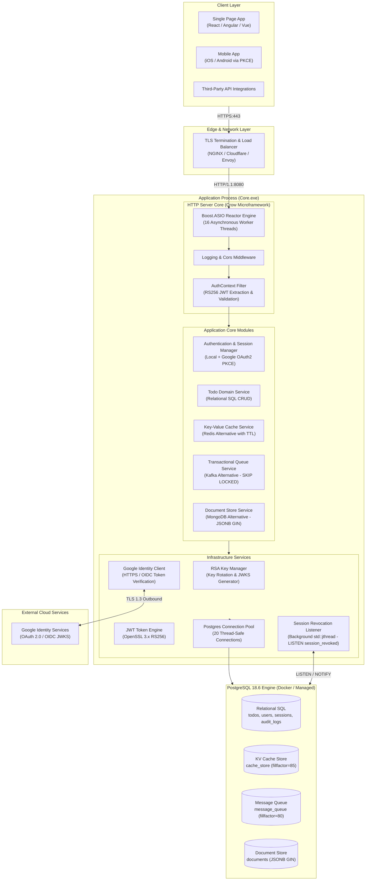
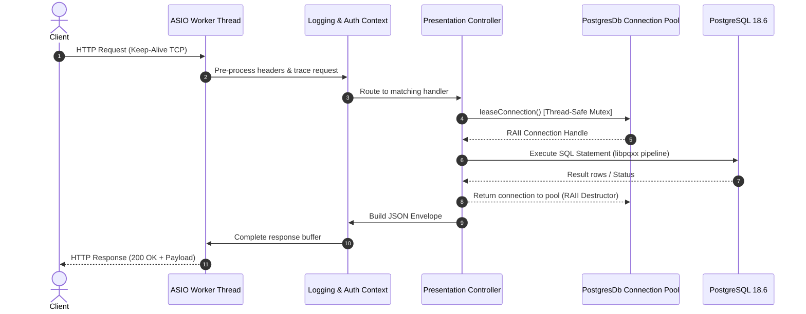
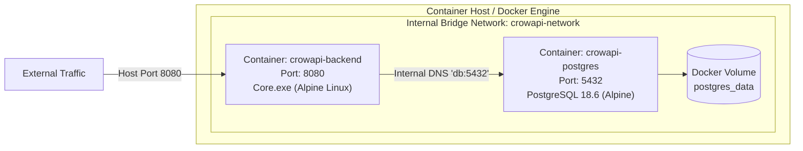

# 01. High-Level System Design & Runtime Topologies

---

## 1. Executive Summary & System Objectives

**CrowApi** is an asynchronous, high-throughput, low-latency REST API service designed for mission-critical applications. Built with **ISO Modern C++20**, the system provides compiled native performance, deterministic memory management via RAII (Resource Acquisition Is Initialization), and a strict **Clean Architecture** boundary separation.

### Core Non-Functional Requirements (NFRs)

* **Throughput & Concurrency**: Support thousands of concurrent HTTP requests per second with sub-millisecond internal routing overhead.
* **Cryptographic Security**: Asymmetric RS256 token signing, OpenSSL 3.x EVP-based cryptographic primitives, RFC 7636 PKCE S256 OAuth protection, and brute-force lockout defenses.
* **Operational Simplicity**: Leverage **PostgreSQL 18.6** as a unified **4-in-1 multi-paradigm storage engine** (Relational SQL + Redis-style KV Cache + Kafka-style Message Queue + MongoDB-style JSONB Document Store), eliminating the operational cost of managing 4 distinct distributed clusters.
* **Deterministic Reliability**: Zero dynamic garbage collection pauses; memory safety enforced by smart pointers (`std::shared_ptr`, `std::unique_ptr`), RAII database connections, and C++20 concepts.

---

## 2. High-Level System Architecture



---

## 3. Concurrency & Threading Model

### 3.1 Crow & Boost.ASIO Reactor Pattern
The HTTP transport layer is powered by **Crow**, which leverages **Boost.ASIO**'s proactor/reactor event loop architecture:
* **Thread Pool**: Configured with **16 worker threads** matching or exceeding the host machine's hardware concurrency (`std::thread::hardware_concurrency()`).
* **Non-Blocking I/O**: Network socket read/write operations are multiplexed asynchronously using epoll (Linux) or IOCP (Windows).
* **Work Distribution**: Incoming TCP connections are distributed evenly among the worker threads. Requests run to completion within the worker thread, avoiding context-switching latency.



### 3.2 Thread-Safe Database Connection Pooling (`PostgresDb`)
Direct database connections are heavy resources. `PostgresDb` implements a high-performance, thread-safe connection pool:
* **Pool Sizing**: Pre-allocates a fixed pool of **20 connections** (configurable via `.env` `DB_POOL_SIZE`).
* **Synchronization**: A `std::mutex` and `std::condition_variable` guard connection checkout and return.
* **RAII Lifecycle**: Callers receive a `ConnectionLease` smart handle. When the handle goes out of scope, the connection automatically returns to the pool, guaranteeing no connection leaks even in exception-throwing paths.
* **Liveness Verification**: Before leasing a connection, the pool checks `conn->is_open()`. If disconnected (e.g. following a database restart), it automatically reconnects seamlessly.

### 3.3 OpenSSL 3.x Thread Safety
Cryptography operations in `OpenSslCrypto` and `RsaKeyManager` utilize OpenSSL 3.x thread-safe EVP APIs:
* **Asymmetric Operations**: Key generation, public key extraction (JWKS export), and signature verification allocate local `EVP_PKEY_CTX` instances per operation to prevent thread contention.
* **Symmetric / Hashing**: SHA-256 digests and PBKDF2 salt stretching allocate independent `EVP_MD_CTX` contexts per request thread.
* **CSPRNG**: `RAND_bytes` utilizes OpenSSL’s internal thread-safe cryptographic pseudo-random generator seeded from system entropy (`/dev/urandom` or `BCryptGenRandom`).

### 3.4 Asynchronous Real-Time Session Revocation Listener
To support instant global token revocation without polling, `PostgresSessionRevocationListener` executes inside an independent background `std::jthread`:
* Runs a persistent PostgreSQL connection executing `LISTEN session_revoked`.
* Whenever an admin revokes a session or a user logs out across all devices, PostgreSQL emits a `NOTIFY session_revoked, '<jti>'`.
* The background thread receives the notification asynchronously and updates the local in-memory token blacklist cache, achieving sub-millisecond token invalidation cluster-wide.

---

## 4. Multi-Paradigm PostgreSQL 18.6 Integration

Rather than deploying, configuring, securing, and monitoring four separate databases (PostgreSQL, Redis, Kafka, and MongoDB), CrowApi consolidates all four paradigms into **PostgreSQL 18.6**:

| Traditional Stack | CrowApi Unified Engine | PostgreSQL Implementation Details | Advantages & Trade-Offs |
| :--- | :--- | :--- | :--- |
| **Relational SQL** (PostgreSQL / MySQL) | `todos`, `users`, `sessions`, `audit_logs` | B-Tree indexes, Foreign Keys with `ON DELETE CASCADE`, check constraints, UUID primary keys. | Full ACID compliance, referential integrity, standardized SQL. |
| **Redis** (Key-Value Cache) | `cache_store` table | Key-Value schema, `expires_at TIMESTAMPTZ` with dedicated index, atomic `ON CONFLICT DO UPDATE` upserts, HOT fillfactor 85. | Zero distributed cache synchronization overhead; transactions can modify cache and relational data atomically. |
| **Apache Kafka** (Message Queue) | `message_queue` table | Topics, JSONB payloads, status lifecycle (`PENDING` -> `PROCESSED` / `FAILED`), concurrency via `FOR UPDATE SKIP LOCKED`. | Strict FIFO order within transactions, no duplicate message delivery, zero queue data loss on node failure. |
| **MongoDB** (Document DB) | `documents` table | `collection_name VARCHAR`, `data JSONB`, GIN index with `jsonb_path_ops`. | Schemaless flexibility, sub-millisecond `@>` containment queries, joined queries with SQL tables if needed. |

---

## 5. Deployment Architectures & Topologies

### 5.1 Native Binary Topology (High-Performance Bare Metal)
* Executable: `Core.exe` (Windows) or `Core` (Linux).
* Runtime dependencies: Only `libpq` (PostgreSQL client) and OpenSSL 3.x runtime libraries.
* Direct hardware utilization with zero virtualization overhead.

### 5.2 Containerized Topology (Docker & Kubernetes)
* Multi-stage build Dockerfile minimizing final image size (~45 MB).
* Alpine Linux base image with non-root security context (`USER appuser`).
* Health check endpoint: `GET /health` polled every 10 seconds.
* Accompanied by `docker-compose.yml` for single-command deployment:
  ```bash
  docker-compose up -d
  ```



---

## 6. Security & Fault Tolerance Principles

1. **RFC 7636 PKCE S256**: All Google OAuth flows enforce Proof Key for Code Exchange with cryptographically random verifiers and SHA-256 challenges, eliminating authorization code interception attacks.
2. **Replay Attack Defenses**: Refresh tokens use hash rotation (`refresh_token_hash` and `previous_refresh_token_hash`). If an expired or already rotated token is replayed, the entire session family is automatically revoked.
3. **Database Fault Recovery**: If the PostgreSQL container restarts, the connection pool detects connection failures, flushes stale file descriptors, and reconnects without crashing the web service.
4. **Rate Limiting & Account Protection**: 5 consecutive failed login attempts automatically lock the user account for 15 minutes (`locked_until`), guarding against brute-force password discovery.
