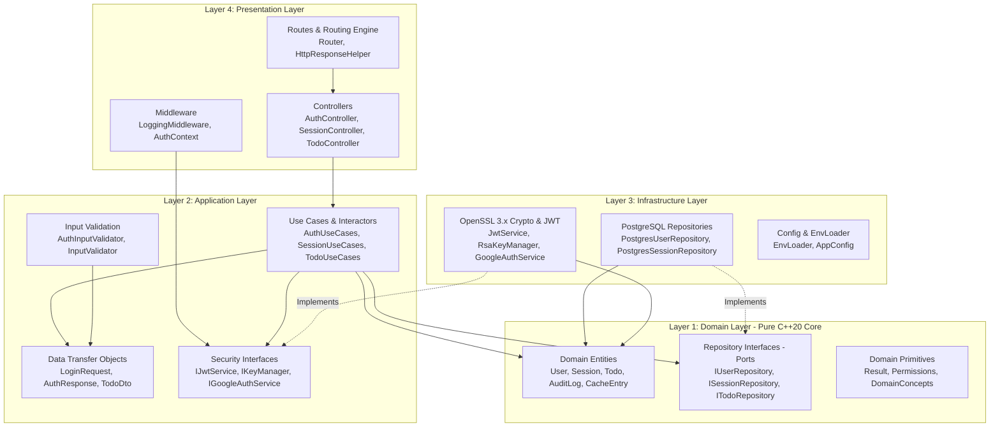

# 02. Detailed Component & Software Architecture

---

## 1. Clean Architecture Paradigm

The CrowApi codebase strictly adheres to **Clean Architecture** (also known as Hexagonal Architecture or Ports & Adapters). The overarching rule is the **Dependency Inversion Principle**: *dependencies must point strictly inward toward the core domain*. Inner layers know nothing about outer layers, database technologies, or HTTP frameworks.



---

## 2. Layer-by-Layer Technical Breakdown

### 2.1 Layer 1: Domain Layer (`Domain/`)
The foundational layer containing enterprise business rules, entity models, and abstract contracts. It has **zero dependencies** on external libraries (no Crow, no libpqxx, no OpenSSL).

* **Entities** (`Domain/Entities/`):
  * [`User`](file:///e:/Projects/CPP/CrowApi/Domain/include/Domain/Entities/User.h): Invariants around email validation, password hashing requirement (optional for Google-only users), failed login attempt tracking, account lockouts, and authentication providers (`local`, `google`, `local+google`).
  * [`Session`](file:///e:/Projects/CPP/CrowApi/Domain/include/Domain/Entities/Session.h): Multi-device session tracking, SHA-256 refresh token hash, token rotation history, client device metadata, and expiration logic.
  * [`Todo`](file:///e:/Projects/CPP/CrowApi/Domain/include/Domain/Entities/Todo.h): Core task entity demonstrating relational domain behaviors.
  * [`CacheEntry`](file:///e:/Projects/CPP/CrowApi/Domain/include/Domain/Entities/CacheEntry.h), [`QueueMessage`](file:///e:/Projects/CPP/CrowApi/Domain/include/Domain/Entities/QueueMessage.h), [`DocumentEntity`](file:///e:/Projects/CPP/CrowApi/Domain/include/Domain/Entities/DocumentEntity.h): Domain models for multi-paradigm storage.
  * [`AuditLog`](file:///e:/Projects/CPP/CrowApi/Domain/include/Domain/Entities/AuditLog.h): Immutable security event audit entity.
* **Repository Interfaces (Ports)** (`Domain/Repositories/`):
  * Pure abstract C++ virtual interfaces (`IUserRepository`, `ISessionRepository`, `ITodoRepository`, `ICacheRepository`, `IMessageQueueRepository`, `IDocumentRepository`, `IAuditLogRepository`).
* **Domain Common** (`Domain/Common/`):
  * `Result<T, E>`: Functional return type for error handling without exceptions.
  * `Permissions.h`: Role-based access control (RBAC) hierarchy (`User`, `Admin`, `SuperAdmin`) with bitwise/set permissions.
  * `DomainConcepts.h`: C++20 concepts ensuring compile-time constraints on repository types and entity models.

---

### 2.2 Layer 2: Application Layer (`Application/`)
Coordinates business workflows and enforces use-case specific logic. It depends **only on the Domain layer**.

* **Use Cases** (`Application/UseCases/`):
  * `AuthUseCases`: Registration, credential verification, Google OAuth 2.0 PKCE code exchange, bidirectional account linking, password setting, and token refresh.
  * `SessionUseCases`: Session retrieval, single session revocation, user-wide logout, and admin revocation.
  * `TodoUseCases`, `CacheUseCases`, `QueueUseCases`, `DocumentUseCases`: Business actions for multi-paradigm storage.
* **Security Contracts (Ports)** (`Application/Security/`):
  * `IJwtService`: Generates and validates RS256 JWTs with kid headers.
  * `IKeyManager`: RSA 2048-bit key rotation and JWKS serialization.
  * `IPasswordHasher`: PBKDF2 salt hashing and verification.
  * `IGoogleAuthService`: Google OAuth URL generation with PKCE and token exchange.
* **Input Validation** (`Application/Validation/`):
  * `AuthInputValidator`: Enforces RFC 5322 email syntax, password complexity (length >= 8, uppercase, lowercase, digits, special characters), and input length limits to block SQL injection and buffer overrun attempts.
* **Data Transfer Objects (DTOs)** (`Application/DTOs/`):
  * Decoupled structs (`LoginRequest`, `RegisterRequest`, `GoogleLoginRequest`, `GoogleAuthUrlResponse`, `SetPasswordRequest`) preventing external HTTP wire payloads from leaking into domain entities.

---

### 2.3 Layer 3: Infrastructure Layer (`Infrastructure/`)
Provides concrete implementations of the abstract ports defined in Domain and Application layers.

* **Persistence & Database (Adapters)** (`Infrastructure/Persistence/`):
  * `PostgresDb`: Thread-safe connection pool managing 20 persistent `pqxx::connection` instances.
  * `PostgresUserRepository`: Parameterized SQL execution using libpqxx prepared statements, protecting against SQL injection.
  * `PostgresSessionRepository`: Multi-session management, active session filtering, and revocation timestamps.
  * `PostgresCacheRepository`: Redis-alternative KV store with automatic TTL expiration logic.
  * `PostgresMessageQueueRepository`: Kafka-alternative queue with transactional `FOR UPDATE SKIP LOCKED` polling.
  * `PostgresDocumentRepository`: MongoDB-alternative schemaless store with JSONB and GIN index operations.
  * `PostgresSessionRevocationListener`: Background `std::jthread` running PostgreSQL `LISTEN session_revoked`.
* **Security & Cryptography** (`Infrastructure/Security/`):
  * `OpenSslCrypto`: OpenSSL 3.x EVP wrappers for SHA-256, PBKDF2-HMAC-SHA256, and CSPRNG random generation.
  * `RsaKeyManager`: Generates 2048-bit RSA keypairs, manages key rotation (`kid`), and exports RFC 7517 compliant JWKS (`/.well-known/jwks.json`).
  * `JwtService`: Encodes and verifies RS256 JSON Web Tokens with expiry (`exp`), subject (`sub`), session ID (`sid`), and key ID (`kid`) validation.
  * `GoogleAuthService`: RFC 7636 PKCE S256 verifier and challenge generation, OAuth 2.0 authorization URL construction, and Google token exchange.
* **Configuration** (`Infrastructure/Config/`):
  * `EnvLoader`: Thread-safe parser for `.env` files with environment variable overrides and type conversion helpers.

---

### 2.4 Layer 4: Presentation Layer (`Presentation/`)
Handles HTTP communication, translates JSON requests into DTOs, calls Application Use Cases, and formats JSON responses.

* **Controllers** (`Presentation/Controllers/`):
  * `AuthController`: Handlers for `/api/v1/auth/register`, `/login`, `/google/url`, `/google/callback`, `/google`, `/refresh`, `/logout`, `/logout-all`, and `/set-password`.
  * `SessionController` & `AdminSessionController`: Self-service and administrative session querying and revocation.
  * `TodoController`, `CacheController`, `QueueController`, `DocumentController`: CRUD and multi-paradigm operational endpoints.
* **Middleware** (`Presentation/Middleware/`):
  * `LoggingMiddleware`: Request/response access logging with execution timing in microseconds, IP logging, and HTTP status categorization.
  * `AuthContext`: Extracts `Authorization: Bearer <token>` headers, verifies the RS256 signature against `RsaKeyManager`, checks for revoked JTIs, and injects authenticated user claims (`userId`, `role`, `sessionId`) into the Crow request context.
* **Routing & Formatting** (`Presentation/Routes/`, `Presentation/Common/`):
  * `Router`: Maps URL routes to controller methods.
  * `HttpResponseHelper`: Formats standard JSON envelopes (`{ "success": true, "statusCode": 200, "data": { ... } }`), parses DTOs, and handles HTTP errors.

---

### 2.5 Layer 5: Core Layer (`Core/`)
The composition root of the application:
* Contains `main()` in `Core/Core.cpp`.
* Initializes the `EnvLoader` and reads runtime configuration.
* Instantiates concrete infrastructure services (`PostgresDb`, `RsaKeyManager`, `JwtService`, `GoogleAuthService`).
* Injects infrastructure implementations into application use cases.
* Injects use cases into presentation controllers.
* Configures Crow routing, log levels, thread pool size (16 threads), and starts the ASIO listener on port 8080.

---

## 3. Dependency Inversion Class Diagram

The following class diagram illustrates how the `AuthUseCases` depend exclusively on abstract interfaces, which are implemented by concrete infrastructure classes:

```mermaid
classDiagram
    direction TB

    class IUserRepository {
        <<interface>>
        +findById(userId) Result~User~
        +findByEmail(email) Result~User~
        +findByGoogleId(googleId) Result~User~
        +save(user) Result~User~
        +update(user) Result~void~
        +linkGoogleAccount(userId, googleId, avatarUrl) Result~void~
    }

    class ISessionRepository {
        <<interface>>
        +createSession(session) Result~Session~
        +findSessionByJti(jti) Result~Session~
        +revokeSession(sessionId, reason) Result~void~
        +revokeAllUserSessions(userId, reason) Result~void~
        +isJtiRevoked(jti) bool
    }

    class IJwtService {
        <<interface>>
        +generateAccessToken(user, session) Result~string~
        +validateToken(token) Result~JwtClaims~
    }

    class IGoogleAuthService {
        <<interface>>
        +createAuthorizationUrl(state, codeChallenge) string
        +exchangeAuthCode(code, codeVerifier) Result~GoogleUserInfo~
    }

    class AuthUseCases {
        -IUserRepository userRepo
        -ISessionRepository sessionRepo
        -IJwtService jwtService
        -IGoogleAuthService googleAuthService
        -ICacheRepository cacheRepo
        +register(request) Result~AuthResponse~
        +login(request) Result~AuthResponse~
        +googleLogin(request) Result~AuthResponse~
        +setPassword(userId, newPassword) Result~void~
        +refreshToken(request) Result~AuthResponse~
    }

    class PostgresUserRepository {
        -PostgresDb db
        +findById(userId) Result~User~
        +findByEmail(email) Result~User~
        +save(user) Result~User~
    }

    class PostgresSessionRepository {
        -PostgresDb db
        +createSession(session) Result~Session~
        +revokeSession(sessionId, reason) Result~void~
    }

    class JwtService {
        -IKeyManager keyManager
        +generateAccessToken(user, session) Result~string~
        +validateToken(token) Result~JwtClaims~
    }

    class GoogleAuthService {
        -string clientId
        -string clientSecret
        +createAuthorizationUrl(state, codeChallenge) string
        +exchangeAuthCode(code, codeVerifier) Result~GoogleUserInfo~
    }

    AuthUseCases --> IUserRepository : uses
    AuthUseCases --> ISessionRepository : uses
    AuthUseCases --> IJwtService : uses
    AuthUseCases --> IGoogleAuthService : uses

    PostgresUserRepository ..|> IUserRepository : implements
    PostgresSessionRepository ..|> ISessionRepository : implements
    JwtService ..|> IJwtService : implements
    GoogleAuthService ..|> IGoogleAuthService : implements
```



---

## 4. Railway-Oriented Error Handling (`Result<T, E>`)

Instead of throwing and catching expensive C++ exceptions across business boundaries, CrowApi implements **Railway-Oriented Programming** via the `Domain::Result<T, E>` template:

```cpp
template <typename T, typename E = Domain::ValidationError>
class Result {
public:
    static Result success(T value);
    static Result failure(E error);

    bool isSuccess() const noexcept;
    bool isFailure() const noexcept;
    
    const T& value() const;
    const E& error() const;
};
```

### Benefits:
1. **Zero Stack Unwinding Overhead**: Error paths return plain values with zero CPU cycle penalty.
2. **Explicit Contracts**: Functions declare every possible failure mode in their signatures, forcing callers to handle errors at compile time.
3. **Seamless HTTP Mapping**: Errors map directly into deterministic HTTP response codes:
   * `NOT_FOUND` -> `404 Not Found`
   * `INVALID_CREDENTIALS` -> `401 Unauthorized`
   * `FORBIDDEN` -> `403 Forbidden`
   * `CONFLICT` -> `409 Conflict` (e.g. Email already registered)
   * `ACCOUNT_LOCKED` -> `423 Locked` (Account temporarily suspended after 5 failed logins)
