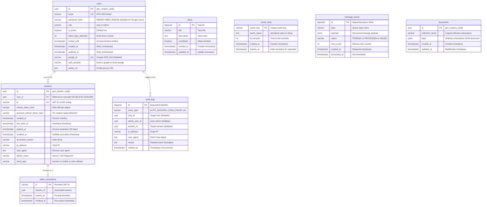

# 03. PostgreSQL 18.6 Multi-Paradigm Database Design

---

## 1. The 4-in-1 Multi-Paradigm Architecture

Modern web architectures often accumulate excessive infrastructure bloat: a relational database for core records, Redis for caching and sessions, Apache Kafka/RabbitMQ for background queues, and MongoDB for schemaless documents. Each extra service requires its own networking, clustering, backup policies, memory overhead, and operational maintenance.

**CrowApi** consolidates all four storage paradigms into **PostgreSQL 18.6**, leveraging PostgreSQL's native capabilities:
1. **Relational SQL Database**: ACID tables (`todos`, `users`, `sessions`, `audit_logs`) with foreign keys, constraints, and cascade rules.
2. **Redis KV Cache Alternative**: `cache_store` with sliding/absolute TTL and atomic `ON CONFLICT DO UPDATE` upserts.
3. **Kafka Message Queue Alternative**: `message_queue` with sub-millisecond transactional polling via `FOR UPDATE SKIP LOCKED`.
4. **MongoDB Document DB Alternative**: `documents` storing `JSONB` with high-speed `jsonb_path_ops` GIN indexing.

---

## 2. Entity-Relationship Diagram (ERD)



---

## 3. Table Specifications & Schema Details

### 3.1 `users` Table (Identity & Accounts)
```sql
CREATE TABLE IF NOT EXISTS users (
    id UUID PRIMARY KEY DEFAULT gen_random_uuid(),
    email VARCHAR(255) UNIQUE NOT NULL,
    password_hash VARCHAR(255), -- NULL if user signs up exclusively via Google
    role VARCHAR(50) NOT NULL DEFAULT 'user',
    is_active BOOLEAN NOT NULL DEFAULT true,
    failed_login_attempts INT NOT NULL DEFAULT 0,
    locked_until TIMESTAMPTZ,
    created_at TIMESTAMPTZ NOT NULL DEFAULT clock_timestamp(),
    updated_at TIMESTAMPTZ NOT NULL DEFAULT clock_timestamp(),
    google_id VARCHAR(128) UNIQUE,
    auth_provider VARCHAR(32) NOT NULL DEFAULT 'local', -- 'local', 'google', 'local+google'
    avatar_url TEXT
);
```

#### Dedicated Indexes:
* `idx_users_email_lower`: `CREATE UNIQUE INDEX idx_users_email_lower ON users (LOWER(email));` Case-insensitive uniqueness enforcement preventing duplicate accounts via `User@Example.com` vs `user@example.com`.
* `idx_users_google_id`: `CREATE INDEX idx_users_google_id ON users (google_id) WHERE google_id IS NOT NULL;` Sparse index for zero-cost Google user lookups without indexing NULLs.
* `idx_users_active_created`: `CREATE INDEX idx_users_active_created ON users (created_at DESC) WHERE is_active = true;` Partial index for fast user listing queries.

---

### 3.2 `sessions` Table (Multi-Session & Token Tracking)
```sql
CREATE TABLE IF NOT EXISTS sessions (
    id UUID PRIMARY KEY DEFAULT gen_random_uuid(),
    user_id UUID NOT NULL REFERENCES users(id) ON DELETE CASCADE,
    jti VARCHAR(255) UNIQUE NOT NULL,
    refresh_token_hash VARCHAR(64) NOT NULL,
    previous_refresh_token_hash VARCHAR(64),
    created_at TIMESTAMPTZ NOT NULL DEFAULT clock_timestamp(),
    last_seen_at TIMESTAMPTZ NOT NULL DEFAULT clock_timestamp(),
    expires_at TIMESTAMPTZ NOT NULL,
    revoked_at TIMESTAMPTZ,
    revocation_reason VARCHAR(255),
    ip_address VARCHAR(100),
    user_agent TEXT,
    device_name VARCHAR(150),
    client_type VARCHAR(50) DEFAULT 'browser'
);

-- HOT Optimization for high-churn heartbeat updates
ALTER TABLE sessions SET (fillfactor = 85);
```

#### Dedicated Partial Indexes:
* `idx_sessions_active`: `CREATE INDEX idx_sessions_active ON sessions (user_id, expires_at) WHERE revoked_at IS NULL;` Active session lookup.
* `idx_sessions_active_user`: `CREATE INDEX idx_sessions_active_user ON sessions (user_id, last_seen_at DESC) WHERE revoked_at IS NULL;` User device session list.
* `idx_sessions_jti_active`: `CREATE INDEX idx_sessions_jti_active ON sessions (jti) WHERE revoked_at IS NULL;` Fast token validation index.
* `idx_sessions_prev_refresh`: `CREATE INDEX idx_sessions_prev_refresh ON sessions (previous_refresh_token_hash) WHERE previous_refresh_token_hash IS NOT NULL;` Replay attack detection index.

---

### 3.3 `cache_store` Table (Redis KV Alternative with TTL)
```sql
CREATE TABLE IF NOT EXISTS cache_store (
    cache_key VARCHAR(255) PRIMARY KEY,
    cache_value TEXT NOT NULL,
    ttl_seconds INT NOT NULL DEFAULT 3600,
    created_at TIMESTAMPTZ NOT NULL DEFAULT clock_timestamp(),
    expires_at TIMESTAMPTZ NOT NULL
);

ALTER TABLE cache_store SET (fillfactor = 85);
CREATE INDEX IF NOT EXISTS idx_cache_expires ON cache_store (expires_at);
```

#### High-Throughput Operations:
* **Atomic Upsert**:
  ```sql
  INSERT INTO cache_store (cache_key, cache_value, ttl_seconds, expires_at)
  VALUES ($1, $2, $3, clock_timestamp() + ($3 || ' seconds')::INTERVAL)
  ON CONFLICT (cache_key) DO UPDATE
  SET cache_value = EXCLUDED.cache_value,
      ttl_seconds = EXCLUDED.ttl_seconds,
      expires_at  = EXCLUDED.expires_at;
  ```
* **Expired Cache Purge**:
  ```sql
  DELETE FROM cache_store WHERE expires_at < clock_timestamp();
  ```

---

### 3.4 `message_queue` Table (Kafka Queue Alternative with SKIP LOCKED)
```sql
CREATE TABLE IF NOT EXISTS message_queue (
    id BIGSERIAL PRIMARY KEY,
    topic VARCHAR(100) NOT NULL,
    payload JSONB NOT NULL,
    status VARCHAR(20) NOT NULL DEFAULT 'PENDING',
    retry_count INT NOT NULL DEFAULT 0,
    created_at TIMESTAMPTZ NOT NULL DEFAULT clock_timestamp(),
    processed_at TIMESTAMPTZ
);

ALTER TABLE message_queue SET (fillfactor = 80);
CREATE INDEX IF NOT EXISTS idx_queue_pending_poll ON message_queue (topic, id ASC) WHERE status = 'PENDING';
```

#### Concurrent Worker Polling (`FOR UPDATE SKIP LOCKED`):
Multiple worker threads poll messages from the same topic simultaneously without blocking each other or producing duplicates:
```sql
UPDATE message_queue
SET status = 'PROCESSING'
WHERE id IN (
    SELECT id
    FROM message_queue
    WHERE topic = $1 AND status = 'PENDING'
    ORDER BY id ASC
    LIMIT $2
    FOR UPDATE SKIP LOCKED
)
RETURNING id, topic, payload;
```

---

### 3.5 `documents` Table (MongoDB Document DB Alternative)
```sql
CREATE TABLE IF NOT EXISTS documents (
    id UUID PRIMARY KEY DEFAULT gen_random_uuid(),
    collection_name VARCHAR(100) NOT NULL,
    data JSONB NOT NULL,
    created_at TIMESTAMPTZ NOT NULL DEFAULT clock_timestamp(),
    updated_at TIMESTAMPTZ NOT NULL DEFAULT clock_timestamp()
);

CREATE INDEX IF NOT EXISTS idx_documents_collection ON documents (collection_name);
CREATE INDEX IF NOT EXISTS idx_documents_data_path_ops ON documents USING GIN (data jsonb_path_ops);
```

#### Why `jsonb_path_ops` GIN Indexing?
* **60% Smaller Index Size**: Rather than indexing every JSON key and value separately, `jsonb_path_ops` hashes entire structural paths (e.g. `{"user": {"role": "admin"}}`).
* **2x Faster Containment Queries**: The `@>` operator checks if the JSON document contains a target JSON fragment in sub-millisecond execution:
  ```sql
  SELECT id, data FROM documents
  WHERE collection_name = $1 AND data @> $2::JSONB;
  ```

---

## 4. Heap-Only Tuples (HOT) & Fillfactor Optimization

High-churn tables (`sessions`, `cache_store`, `message_queue`) frequently update timestamps or statuses. In standard PostgreSQL:
* Every row update writes a new row version (tuple) to a disk page.
* If the page has no free space, the tuple is placed on a different page.
* Every index referencing the table must then be updated with the new tuple pointer, causing write amplification and index bloat.

### The Solution:
By setting `fillfactor = 85` on `sessions` and `cache_store`, PostgreSQL leaves **15% of each 8KB page empty** during initial inserts:
1. When `last_seen_at` is updated, the new tuple is placed in the **same disk page**.
2. If no indexed columns changed, PostgreSQL creates a **Heap-Only Tuple (HOT)** link inside the page.
3. Zero index updates are required. Index bloat is eliminated and disk write I/O is reduced by up to 70%.
