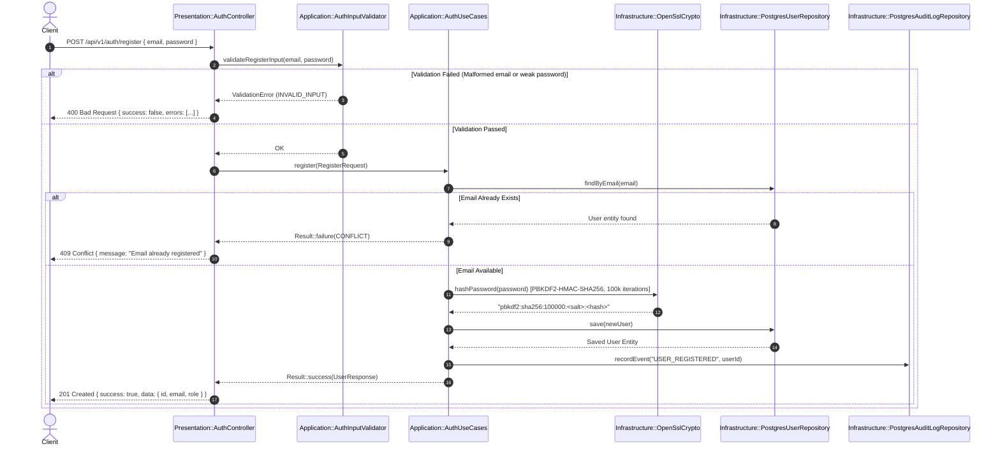
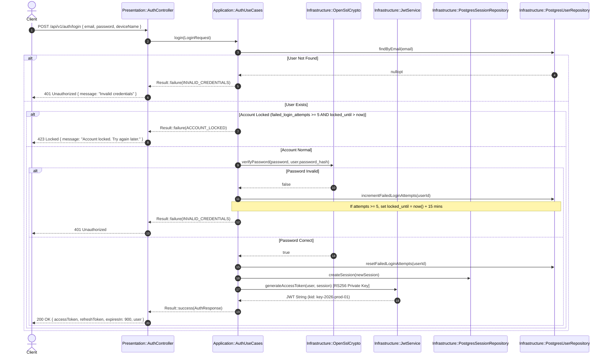
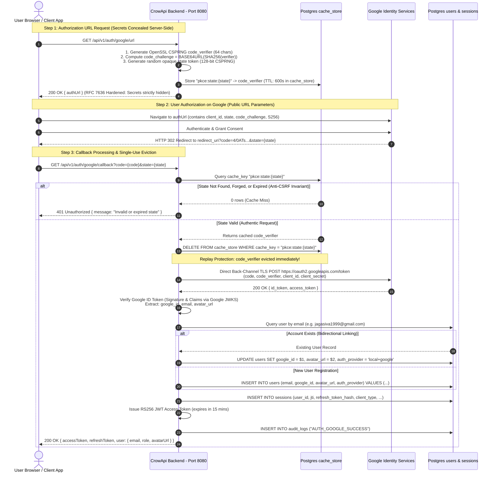
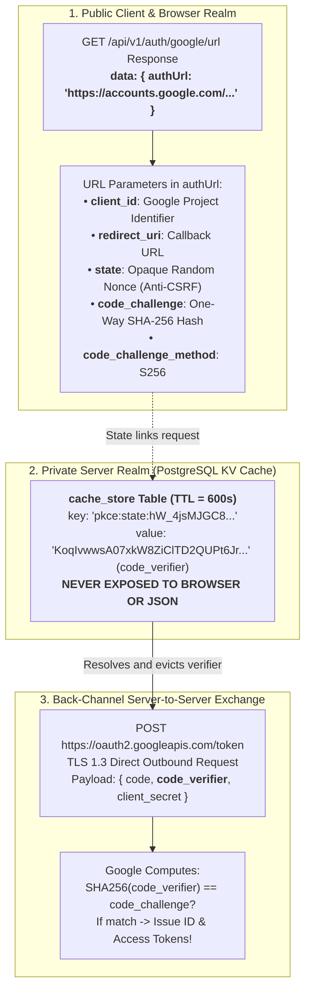
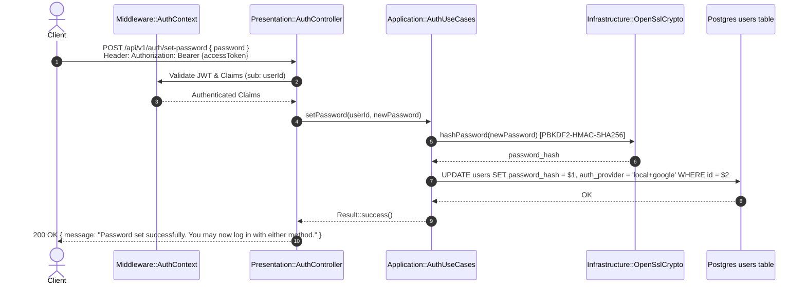
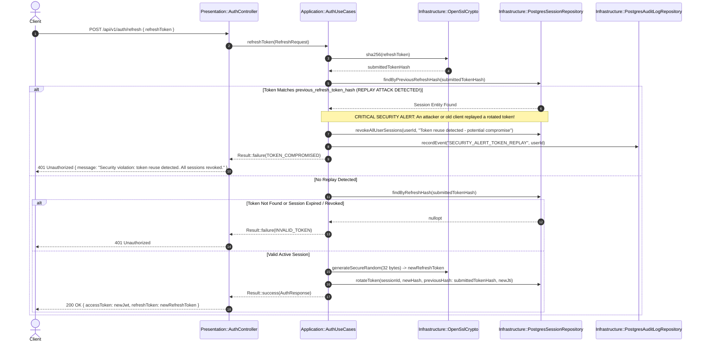
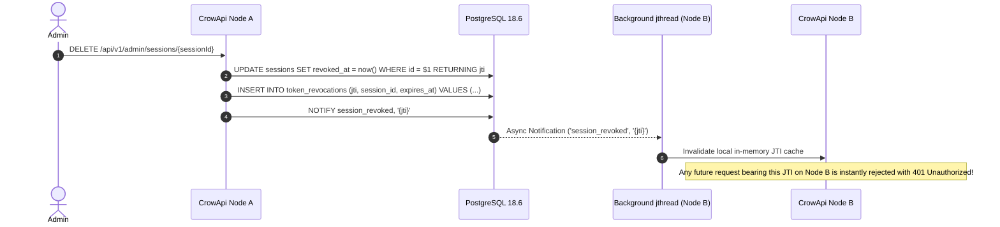

# 04. API Flows, OAuth2 PKCE & Security Sequences

---

## 1. Authentication & Security Sequences

### 1.1 Standard User Registration Flow (`POST /api/v1/auth/register`)

---

### 1.2 Local User Login & Brute-Force Defenses (`POST /api/v1/auth/login`)

---

### 1.3 Google OAuth 2.0 / OIDC Flow with RFC 7636 PKCE S256

The OAuth 2.0 flow is secured using **Proof Key for Code Exchange (PKCE)** with the `S256` code challenge method.

---

### 1.3.1 PKCE Parameter Anatomy, Privacy Guarantees & Threat Defenses

#### Why This Step & Architecture Exists

In standard OAuth 2.0 without PKCE, an authorization code returned in a browser redirect can be intercepted by malicious browser extensions, rogue URL protocol handlers, or proxy logs. Furthermore, exposing raw cryptographic secrets in client API responses violates **CWE-200 (Information Exposure)**. 

CrowApi resolves this through strict **Server-Assisted PKCE with Zero Secret Exposure**:

#### Parameter Breakdown & Opacity Analysis

| Parameter | In Response JSON? | In Authorization URL? | Purpose | Why It Is Safe / How Opacity Is Maintained |
| :--- | :---: | :---: | :--- | :--- |
| **`code_verifier`** | ❌ **NO** | ❌ **NO** | The master cryptographic secret used to prove possession during token exchange. | **Stored strictly server-side** in PostgreSQL `cache_store` with a 10-minute TTL. Never logged, never transmitted to browser or frontend clients. |
| **`code_challenge`** | ❌ **NO** | ✅ **YES** | Mandatory for Google’s authorization endpoint to register the expected hash. | **One-Way Irreversible SHA-256 Hash**: $$\text{code\_challenge} = \text{Base64URL}(\text{SHA-256}(\text{code\_verifier}))$$ Computationally impossible to reverse into the verifier. Safe to transmit publicly in the URL. |
| **`state`** | ❌ **NO** | ✅ **YES** | Mandatory OAuth 2.0 (RFC 6749 §10.12) CSRF protection & session binding. | **128-bit Random Cryptographic Nonce** generated via OpenSSL `RAND_bytes`. Contains zero user info, zero credentials, zero internal IDs. Opaque random string. |

#### Attack Defenses Implemented
1. **Authorization Code Interception (Thwarted)**: If a malicious actor intercepts `code` from the redirect URI, they cannot exchange it because Google requires `code_verifier`, which resides exclusively in CrowApi's private database.
2. **Cross-Site Request Forgery (Thwarted)**: If an attacker triggers a forged callback, the `state` will either be absent or unmatched in `cache_store`, causing CrowApi to immediately abort with `401 Unauthorized` before reaching Google.
3. **Replay Attacks (Thwarted)**: Upon the very first callback execution, `DELETE FROM cache_store WHERE cache_key = 'pkce:state:{state}'` occurs atomically. A replayed callback cannot retrieve the verifier and fails.

---

### 1.4 Bidirectional Account Linking (`POST /api/v1/auth/set-password`)

When a user registers exclusively via Google OAuth, `password_hash` is initialized as `NULL`. The system allows users to set a local password to enable dual authentication:

---

### 1.5 Refresh Token Rotation & Replay Attack Detection (`POST /api/v1/auth/refresh`)

To prevent stolen refresh tokens from remaining indefinitely valid, every refresh operation rotates the token and detects reuse:

---

### 1.6 Real-Time Session Revocation via PostgreSQL `LISTEN / NOTIFY`

When an administrator revokes a session or a user clicks "Logout from All Devices", all connected API instances instantly blacklist the token in memory:

---

## 2. Multi-Paradigm API Endpoints

### 2.1 Relational CRUD (`/api/todos`)
* `GET /api/todos`: Paginated task listing (`page`, `limit`).
* `POST /api/todos`: Create a new todo (`title`, `description`).
* `GET /api/todos/<id>`: Retrieve single todo.
* `PUT /api/todos/<id>`: Update title, description, or completed status.
* `DELETE /api/todos/<id>`: Delete todo.

### 2.2 Redis KV Cache Alternative (`/api/cache`)
* `GET /api/cache/<key>`: Fetch cached value (returns `404` if key does not exist or has expired).
* `POST /api/cache`: Set key-value pair with optional TTL (`key`, `value`, `ttlSeconds`).
* `DELETE /api/cache/<key>`: Explicitly delete a cache entry.
* `POST /api/cache/cleanup`: Trigger background cleanup of expired cache entries.

### 2.3 Kafka Queue Alternative (`/api/queue`)
* `POST /api/queue/publish`: Enqueue message (`topic`, `payload: { ... }`).
* `POST /api/queue/poll`: Drain pending messages with `FOR UPDATE SKIP LOCKED` (`topic`, `batchSize`).
* `POST /api/queue/ack/<id>`: Acknowledge successful processing (`status = 'PROCESSED'`).
* `POST /api/queue/fail/<id>`: Mark message as failed for retry handling (`status = 'FAILED'`).
* `GET /api/queue/metrics`: Queue depth and status distribution metrics.

### 2.4 MongoDB Document DB Alternative (`/api/documents`)
* `POST /api/documents/<collection>`: Store arbitrary schemaless JSON document.
* `GET /api/documents/<collection>/<id>`: Retrieve document by UUID.
* `POST /api/documents/<collection>/query`: Query collection using JSONB containment (`@>`) via GIN index.
* `PUT /api/documents/<collection>/<id>`: Replace or update document content.
* `DELETE /api/documents/<collection>/<id>`: Delete document.
