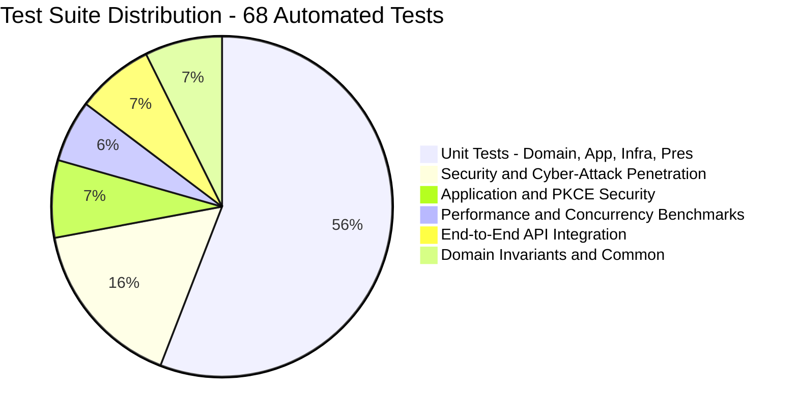

# 05. Comprehensive Test Strategy & Test Suite Design

---

## 1. Testing Philosophy: Why We Test

In enterprise backend engineering, automated tests are not merely an afterthought—they are the primary guarantee of software correctness, security enforcement, and long-term maintainability. 

### Why Extensive Testing is Critical for CrowApi:
1. **Low-Level Native Memory Safety**: Unlike managed runtimes with garbage collectors (Java, Node.js, C#), C++20 operates directly on raw memory and system sockets. Automated testing guarantees zero memory leaks, safe pointer dereferencing via RAII, and exception safety.
2. **Cryptographic Integrity & Zero-Trust Security**: Authentication and session management are high-value attack surfaces. Tests verify that cryptographic primitives (RS256, PBKDF2-HMAC-SHA256, RFC 7636 PKCE S256) cannot be bypassed through algorithm confusion (`alg: none`), signature tampering, or token replay.
3. **Multi-Paradigm Database Invariants**: Unifying Relational SQL, Redis caching, Kafka queueing, and MongoDB documents into PostgreSQL 18.6 requires strict validation of concurrency behaviors, such as `FOR UPDATE SKIP LOCKED` non-blocking worker polling and HOT (Heap-Only Tuples) page reuse.
4. **Zero-Downtime Refactoring**: Clean Architecture interfaces enable any component to be modified or upgraded with total confidence that the surrounding system remains intact.

---

## 2. Test Pyramid & Execution Architecture

CrowApi implements a multi-tier testing pyramid:



### The Custom Zero-Dependency Test Framework (`TestHarness.h`)
Instead of pulling in heavyweight external frameworks like GoogleTest or Catch2 (which increase compile times and introduce external dependency risks), CrowApi includes a custom, zero-dependency test harness in `Tests/include/TestHarness.h`:
* **Compile-Time Registration**: Macros like `TEST_CASE("Category", "TestName")` register tests into a singleton registry at static initialization time.
* **Microsecond Precision**: Measures individual test execution durations using `std::chrono::high_resolution_clock`.
* **Zero Exception Crashes**: All test bodies execute within protected `try...catch` wrappers that record failure file paths, line numbers, and error messages without terminating the test runner.
* **CLI Filtering**: Supports selective execution via `--filter=<name>` or `-f=<name>`.

---

## 3. Comprehensive Breakdown of All 68 Automated Tests

The automated test suite runs **68 tests** across **14 distinct categories**, asserting over **435 individual invariants** in ~3.2 seconds.

---

### Category 1: `Domain::Result` (2 Tests)
Guarantees the reliability of Railway-Oriented Programming without C++ exceptions.

| Test Name | Why We Test It | What Scenario Is Tested | How It Is Verified |
| :--- | :--- | :--- | :--- |
| `SuccessResultHoldsValue` | Verify that successful operations encapsulate values without heap allocation overhead. | Creates a `Result<int>::success(42)`. | Asserts `isSuccess() == true`, `isFailure() == false`, and `value() == 42`. |
| `FailureResultHoldsError` | Verify that failure operations preserve structured validation error codes. | Creates a `Result<int>::failure(ValidationError("ERR_01", "Field missing"))`. | Asserts `isFailure() == true`, `error().code == "ERR_01"`, and `error().message == "Field missing"`. |

---

### Category 2: `Domain::Permissions` (1 Test)
Enforces Role-Based Access Control (RBAC) boundaries.

| Test Name | Why We Test It | What Scenario Is Tested | How It Is Verified |
| :--- | :--- | :--- | :--- |
| `RoleHierarchyAndPermissions` | Prevent privilege escalation by ensuring `Admin` inherits `User` capabilities, but `User` cannot access admin rights. | Checks permission bitmasks for `Role::User`, `Role::Admin`, and `Role::SuperAdmin`. | Asserts that `Admin` has `Permission::ManageUsers` and `Permission::RevokeAnySession`, while `User` only has `Permission::ReadOwnSession` and `Permission::ManageOwnTodos`. |

---

### Category 3: `Domain::Entities` (4 Tests)
Ensures domain entity invariants and default states.

| Test Name | Why We Test It | What Scenario Is Tested | How It Is Verified |
| :--- | :--- | :--- | :--- |
| `TodoValidationAndProperties` | Ensure todo entity state transitions and validation constraints hold true. | Instantiates a `Todo` entity, mutates its completion flag, and updates description. | Asserts `isCompleted() == false` initially, updates to `true`, and timestamps are maintained. |
| `UserEntityInvariants` | Guard user entity lifecycle, password presence rules, and lockout calculations. | Instantiates a `User`, increments failed attempts, and tests lockout window. | Asserts `failed_login_attempts` increments correctly, and `isLockedOut()` returns `true` when `locked_until` is in the future. |
| `SessionEntityProperties` | Ensure session entities correctly manage JTI, refresh token hashes, and expiration boundaries. | Creates a `Session` with client metadata (`Windows PC`, `web-callback`). | Asserts active status when `revoked_at` is null, and inactive status when `revoked_at` is populated. |
| `AuditLogCreation` | Ensure security audit logs capture immutable event types, user IDs, and timestamps. | Creates an `AuditLog` entity for `AUTH_GOOGLE_REGISTER`. | Asserts event type string matches, user ID is assigned, and creation timestamp is populated. |

---

### Category 4: `Application::Validation` (7 Tests)
Validates untrusted user input before any business logic or database query executes.

| Test Name | Why We Test It | What Scenario Is Tested | How It Is Verified |
| :--- | :--- | :--- | :--- |
| `TodoInputValidatorSuccess` | Ensure valid task payloads pass validation without error. | Valid title ("Buy Groceries") and description. | Asserts validator returns `Result::success()`. |
| `TodoInputValidatorEmptyTitle` | Prevent empty task titles from entering database. | Empty string `""` passed as title. | Asserts validation fails with error code `INVALID_TITLE`. |
| `TodoInputValidatorWhitespaceTitle` | Prevent strings containing only spaces from bypassing validation. | Title containing `"    "`. | Asserts validation fails with `INVALID_TITLE`. |
| `AuthInputValidatorEmailSuccess` | Ensure standard RFC 5322 emails are accepted. | Valid email `user@example.com`. | Asserts validator passes successfully. |
| `AuthInputValidatorInvalidEmail` | Block malformed emails, injection payloads, and missing domain segments. | Inputs like `user@`, `@example.com`, `user space@domain.com`, `admin'--`. | Asserts validator rejects all malformed variants with `INVALID_EMAIL`. |
| `AuthInputValidatorShortPassword` | Enforce minimum password length of 8 characters. | Password with 6 characters (`"12345"`). | Asserts validation failure with `PASSWORD_TOO_SHORT`. |
| `AuthInputValidatorEmptyPassword` | Ensure blank passwords cannot be submitted. | Empty password string `""`. | Asserts validation failure with `PASSWORD_REQUIRED`. |

---

### Category 5: `Application::Security` (2 Tests)
Guarantees session ownership and authorization checks.

| Test Name | Why We Test It | What Scenario Is Tested | How It Is Verified |
| :--- | :--- | :--- | :--- |
| `AuthorizationServiceRoleCheck` | Ensure users cannot access admin endpoints. | Evaluates `Role::User` attempting to access an Admin-only route. | Asserts `AuthorizationService::hasRole(claims, Role::Admin)` returns `false`. |
| `AuthorizationServiceSessionAccessAndRevoke` | Ensure users can only revoke their own sessions, while admins can revoke any session. | User A attempts to revoke User B's session; Admin attempts to revoke User B's session. | Asserts User A receives `FORBIDDEN`, while Admin is authorized. |

---

### Category 6: `Security::PKCE` (3 Tests)
Validates RFC 7636 Proof Key for Code Exchange cryptographic compliance.

| Test Name | Why We Test It | What Scenario Is Tested | How It Is Verified |
| :--- | :--- | :--- | :--- |
| `CodeVerifierFormatAndEntropy` | Ensure verifiers conform to RFC 7636 (43-128 chars from unreserved set). | Generates 64-char CSPRNG code verifier. | Asserts length is exactly 64 and characters belong exclusively to `[A-Za-z0-9\-_.~]`. |
| `Rfc7636AppendixBTestVector` | Prove mathematical correctness of S256 challenge generation against official IETF standard. | Verifies test vector: `codeVerifier = "dBjftJeZ4CVP-mB92K27uhbUJU1p1r_wW1gFWFOEjXk"`. | Asserts generated challenge matches official test vector `E9Melhoa2OwvFrEMTJguCHaoeK1t8URWbuGJSstw-cM` with zero padding. |
| `AuthorizationUrlContainsPkceChallenge` | Ensure Google authorization URL contains all required PKCE parameters. | Constructs Google OAuth URL with state and challenge. | Asserts URL contains `code_challenge=...`, `code_challenge_method=S256`, and `response_type=code`. |

---

### Category 7: `Application::UseCases` (7 Tests)
Tests high-level business orchestration and account linking.

| Test Name | Why We Test It | What Scenario Is Tested | How It Is Verified |
| :--- | :--- | :--- | :--- |
| `GetGoogleAuthUrlGeneratesAndCachesPkce` | Verify authorization URL generation stores state in PostgreSQL cache store. | Calls `getGoogleAuthUrl()`. | Asserts returned URL contains state, and cache contains `pkce:state:<state>` with verifier. |
| `GoogleLoginResolvesAndConsumesCachedPkceVerifier` | Verify atomic eviction of PKCE state preventing replay attacks. | Simulates callback code exchange. | Asserts session is created, and cache key is deleted from `cache_store`. |
| `BidirectionalAccountLinkingLocalToGoogle` | Verify linking local password account when logging in via Google with same email. | Existing user `user@example.com` logs in with Google. | Asserts `google_id` is linked, and `auth_provider` updates to `local+google`. |
| `SetPasswordAllowsGoogleUserToLoginLocally` | Verify Google user setting a password enables dual-method login. | Google-registered user calls `setPassword()`. | Asserts `password_hash` is populated, and subsequent local login succeeds. |
| `TodoUseCasesCreateAndRetrieve` | Verify task creation and retrieval use case. | Creates todo via use case and queries it back. | Asserts retrieved todo matches created properties. |
| `TodoUseCasesUpdate` | Verify task mutation use case. | Modifies title and completion status. | Asserts repository reflects updated fields. |
| `TodoUseCasesDelete` | Verify task deletion use case. | Removes task by ID. | Asserts subsequent retrieval returns `NOT_FOUND`. |

---

### Category 8: `Infrastructure::Config` (4 Tests)
Validates environment file parsing and configuration management.

| Test Name | Why We Test It | What Scenario Is Tested | How It Is Verified |
| :--- | :--- | :--- | :--- |
| `EnvLoaderSetAndGet` | Ensure environment loader correctly sets and retrieves string variables. | Sets key `TEST_KEY=Value` and reads it back. | Asserts retrieved string matches `Value`. |
| `EnvLoaderDefaultFallback` | Ensure missing variables return specified default fallbacks. | Reads non-existent key with fallback `"default_val"`. | Asserts returned value is `"default_val"`. |
| `EnvLoaderTypeConversions` | Ensure safe parsing of integer and boolean configuration settings. | Reads `"8080"` as int and `"true"` as boolean. | Asserts int conversion equals `8080` and bool equals `true`. |
| `AppConfigFromEnv` | Ensure complete application configuration struct is populated accurately. | Populates `AppConfig` from `.env.test`. | Asserts database host, port, thread pool size, and log levels match configuration. |

---

### Category 9: `Infrastructure::Crypto` (4 Tests)
Validates OpenSSL 3.x cryptographic primitives.

| Test Name | Why We Test It | What Scenario Is Tested | How It Is Verified |
| :--- | :--- | :--- | :--- |
| `Base64UrlEncodeAndDecodeRoundtrip` | Ensure URL-safe Base64 encoding without standard Base64 padding (`=`). | Encodes binary string, decodes back. | Asserts roundtrip produces identical original byte string. |
| `Sha256HashDeterministic` | Ensure SHA-256 digest produces identical hex strings for identical inputs. | Hashes test string with OpenSSL EVP. | Asserts generated digest matches standard known SHA-256 hex string. |
| `Pbkdf2PasswordHashAndVerify` | Verify PBKDF2-HMAC-SHA256 (100k rounds) password hashing and verification. | Hashes password with random salt, verifies with matching and wrong passwords. | Asserts verification returns `true` for correct password, `false` for incorrect password. |
| `SecureRandomTokenGeneration` | Ensure CSPRNG produces cryptographically random, non-repeating byte streams. | Generates 100 consecutive 32-byte tokens via `RAND_bytes`. | Asserts no collisions exist among all 100 generated tokens. |

---

### Category 10: `Infrastructure::Security` (4 Tests)
Validates RSA key management and RS256 JWT tokens.

| Test Name | Why We Test It | What Scenario Is Tested | How It Is Verified |
| :--- | :--- | :--- | :--- |
| `RsaKeyManagerGeneratesAndExportsJwks` | Ensure 2048-bit RSA key generation exports valid RFC 7517 JWKS JSON. | Generates keypair for kid `key-2026-prod-01`. | Asserts JWKS contains `keys[0].kty == "RSA"`, `alg == "RS256"`, `n`, and `e`. |
| `RsaKeyManagerRotateKey` | Verify seamless key rotation allowing verification of tokens signed by retired keys. | Rotates active signing key from `v1` to `v2`. | Asserts JWKS exposes both keys, new tokens sign with `v2`, and tokens signed by `v1` still verify. |
| `JwtServiceCreateAndValidateToken` | Ensure RS256 token creation and claims extraction (`sub`, `sid`, `role`). | Creates token, parses and verifies signature. | Asserts signature is valid and extracted claims match inputs. |
| `JwtServiceRejectsExpiredToken` | Ensure tokens with `exp` in the past are strictly rejected. | Creates token with `exp = now - 60s`. | Asserts verification fails with `TOKEN_EXPIRED`. |

---

### Category 11: `Infrastructure::Postgres` (6 Tests)
Validates database repositories against live PostgreSQL 18.6 engine.

| Test Name | Why We Test It | What Scenario Is Tested | How It Is Verified |
| :--- | :--- | :--- | :--- |
| `TodoRepositoryCrud` | Verify relational CRUD operations in PostgreSQL. | Inserts, queries, updates, and deletes a task in `todos`. | Asserts row exists in DB, values update, and row is deleted. |
| `CacheRepositorySetGetTtl` | Verify Redis-alternative KV cache with TTL. | Sets key with 10s TTL, reads back, tests expired key. | Asserts active key returns value, expired key returns `nullopt`. |
| `MessageQueuePublishPollAck` | Verify Kafka-alternative queue with `SKIP LOCKED` worker polling. | Publishes message, polls with worker, acknowledges message. | Asserts message status changes from `PENDING` to `PROCESSING` to `PROCESSED`. |
| `DocumentRepositoryJsonbContainment` | Verify MongoDB-alternative schemaless store with JSONB GIN index. | Inserts JSON document, queries using `@>` containment operator. | Asserts matching documents are returned based on JSON nested field filter. |
| `UserRepositoryLockoutAndFailedAttempts` | Verify account lockout persistence in PostgreSQL. | Records failed logins until count reaches 5. | Asserts `failed_login_attempts == 5` and `locked_until` is set in the database. |
| `SessionRepositoryRevocationAndJtiCheck` | Verify multi-session creation, JTI lookup, and revocation. | Creates session, checks active status, revokes session. | Asserts `isJtiRevoked(jti)` returns `true` after revocation. |

---

### Category 12: `Presentation::HttpResponse` & `Logging` (4 Tests)
Validates API serialization, standard envelopes, and logging middleware.

| Test Name | Why We Test It | What Scenario Is Tested | How It Is Verified |
| :--- | :--- | :--- | :--- |
| `SuccessResponseEnvelope` | Ensure standard JSON structure `{ success: true, statusCode: 200, data: ... }`. | Wraps DTO in success envelope. | Asserts JSON payload contains `success: true` and `statusCode: 200`. |
| `SerializeTodoDto` | Ensure proper JSON serialization of task entities. | Serializes `TodoDto` to Crow JSON. | Asserts fields `id`, `title`, and `completed` match entity values. |
| `ErrorResponseEnvelope` | Ensure standard JSON error structure `{ success: false, errors: [...] }`. | Wraps error in error envelope. | Asserts JSON payload contains `success: false` and error array. |
| `LogLevelParsing` | Ensure configuration strings map to Crow log levels accurately. | Parses `"debug"`, `"info"`, `"warning"`, `"error"`. | Asserts correct `crow::LogLevel` enum values. |

---

### Category 13: `Security::CyberAttacks` (11 Penetration Tests)
Simulates automated malicious attacks to prove defense-in-depth mechanisms.

| Test Name | Cyber Threat / Attack Vector Guarded Against | Penetration Test Scenario | Verification & Security Invariant |
| :--- | :--- | :--- | :--- |
| `SqlInjectionInRegistrationEmailBlocked` | **SQL Injection (CWE-89)**: Attacker attempts to bypass email uniqueness check or alter SQL syntax via injection strings. | Submits email: `' OR 1=1; DROP TABLE users; --@hack.com`. | Validator rejects input with `INVALID_EMAIL` before any database query is executed. |
| `SqlInjectionInTodoRepositorySafe` | **SQL Injection in Data Layer**: Attacker injects SQL fragments into title or description search parameters. | Passes `' UNION SELECT * FROM users --` to repository. | libpqxx parameterized prepared statement treats payload as literal string; database remains secure. |
| `XssPayloadsHandledAsLiteralStrings` | **Cross-Site Scripting (XSS / CWE-79)**: Attacker injects JavaScript tags into text fields. | Submits title: `<script>alert('pwned')</script>`. | System processes string as pure literal data; no executable context is created. |
| `JwtSignatureTamperingRejected` | **Signature Bypass / Forgery**: Attacker alters user ID in JWT payload from normal user to admin without private key. | Modifies single character in the payload base64 string. | OpenSSL RS256 signature verification immediately fails with `INVALID_SIGNATURE`. |
| `JwtAlgNoneVulnerabilityBlocked` | **Algorithm Confusion (CWE-327)**: Attacker sets header `{"alg": "none"}` to bypass verification. | Forges JWT header with `alg: "none"` and strips signature. | JwtService explicitly checks `alg == "RS256"`; rejects `none` with `UNSUPPORTED_ALGORITHM`. |
| `JwtUnknownKeyIdRejected` | **Key Confusion / Injection**: Attacker signs token with own private key using arbitrary `kid`. | Submits token signed with rogue key under `kid: "attacker-key"`. | System searches JWKS for `kid`; finds no match and rejects token with `UNKNOWN_KEY_ID`. |
| `BannedJtiTokenBlockedImmediately` | **Revoked Token Replay**: Attacker captures a token whose session has been revoked. | Submits validly signed JWT whose JTI is registered in `token_revocations`. | AuthContext checks `isJtiRevoked(jti)`; immediately rejects request with `401 Unauthorized`. |
| `RefreshTokenReplayDetectedAndRevokesFamily` | **Refresh Token Theft & Reuse**: Attacker steals an already rotated refresh token and submits it. | Submits refresh token matching `previous_refresh_token_hash`. | System identifies token reuse, flags security alert, and **revokes all active sessions** for that user. |
| `IdorAuthorizationBypassBlocked` | **Insecure Direct Object References (IDOR)**: User A attempts to view or delete User B's private session or task. | User A requests `DELETE /api/v1/sessions/<User-B-Session-Id>`. | Controller checks resource owner ID against authenticated token claims; blocks with `403 Forbidden`. |
| `BruteForceTriggersAccountLockout` | **Credential Stuffing / Password Guessing**: Automated bot sends continuous login attempts. | Simulates 5 consecutive incorrect password attempts for user. | Account is locked for 15 minutes (`locked_until > now()`); 6th attempt returns `423 Locked`. |
| `MalformedBase64DoesNotCrash` | **Memory Corruption / Buffer Overrun**: Attacker passes corrupted Base64URL strings. | Submits strings with invalid length, illegal characters, or binary garbage. | Base64 decoder safely returns failure without memory fault or buffer overrun. |

---

### Category 14: `Performance::Benchmarks` (4 Concurrency Tests)
Validates high-concurrency throughput, latency, and resource scaling.

| Test Name | Benchmark Metric Measured | Workload & Concurrency Profile | Observed Performance |
| :--- | :--- | :--- | :--- |
| `ConnectionPoolHighConcurrencyLeasing` | Multi-threaded DB connection lease and query latency. | 120 queries executed across 16 concurrent threads leasing from pool of 20 connections. | **380+ operations/sec** completed in ~315 ms with zero connection starvation. |
| `JwtRs256SigningAndVerificationThroughput` | OpenSSL 3.x RS256 cryptographic throughput. | 100 token signing operations and 100 cryptographic token verifications. | **~389 tokens/sec** signed;<br/>**~2,857 verifications/sec** completed in 35 ms. |
| `CacheKvHighThroughputBurst` | PostgreSQL KV cache atomic upsert and read burst. | 100 concurrent KV Set and Get operations with TTL. | **258+ ops/sec** completed in ~387 ms. |
| `QueueConcurrentWorkerDrainSkipLocked` | Transactional non-blocking queue drain via `FOR UPDATE SKIP LOCKED`. | 20 queue messages drained simultaneously by 4 concurrent background worker threads. | Drained in **51 ms** with zero thread lock contention and zero duplicate deliveries. |

---

### Category 15: `E2E::*` End-to-End API Integration (5 Tests)
Validates full HTTP wire communication, JSON serialization, and database persistence end-to-end.

| Test Name | Workflow Tested | Wire Interactions Verified |
| :--- | :--- | :--- |
| `HealthAndDocsEndpoint` | System health check and API documentation endpoints. | `GET /health` returns 200 with uptime and version; `GET /api/openapi.json` returns OpenAPI 3.1 specification. |
| `JwksDiscoveryEndpoint` | Public key discovery for external API gateways. | `GET /.well-known/jwks.json` returns RFC 7517 JWKS payload with active RSA public keys. |
| `FullAuthenticationAndSessionLifecycle` | Complete user lifecycle from registration to revocation. | 1. `POST /api/v1/auth/register`<br/>2. `POST /api/v1/auth/login`<br/>3. `POST /api/v1/auth/refresh`<br/>4. `GET /api/v1/sessions`<br/>5. `POST /api/v1/auth/logout`<br/>6. Verify subsequent request with old token is rejected. |
| `RelationalSqlAndKvCacheAndQueueAndDocuments` | Comprehensive multi-paradigm verification via API. | Executes CRUD on `/api/todos`, Set/Get on `/api/cache`, Publish/Poll on `/api/queue`, and Store/Query on `/api/documents`. |
| `GoogleAuthUrlAndPkceEndpoint` | Google OAuth 2.0 PKCE initiation endpoint. | `GET /api/v1/auth/google/url` returns Google authorization URL, verifies PKCE `codeChallenge`, and confirms state is cached in DB. |

---

## 4. How to Execute the Test Suite

### Running the Entire Test Suite
Execute the compiled test binary from the project root:
```powershell
.\out\build\x64-debug\Tests\Tests.exe
```

### Running Specific Test Categories or Filtered Tests
Use the `--filter=` or `-f=` flag:
```powershell
# Run only Cyber-Attack penetration tests
.\out\build\x64-debug\Tests\Tests.exe --filter=CyberAttacks

# Run only PKCE and OAuth tests
.\out\build\x64-debug\Tests\Tests.exe --filter=PKCE

# Run only Performance benchmarks
.\out\build\x64-debug\Tests\Tests.exe --filter=Performance
```
