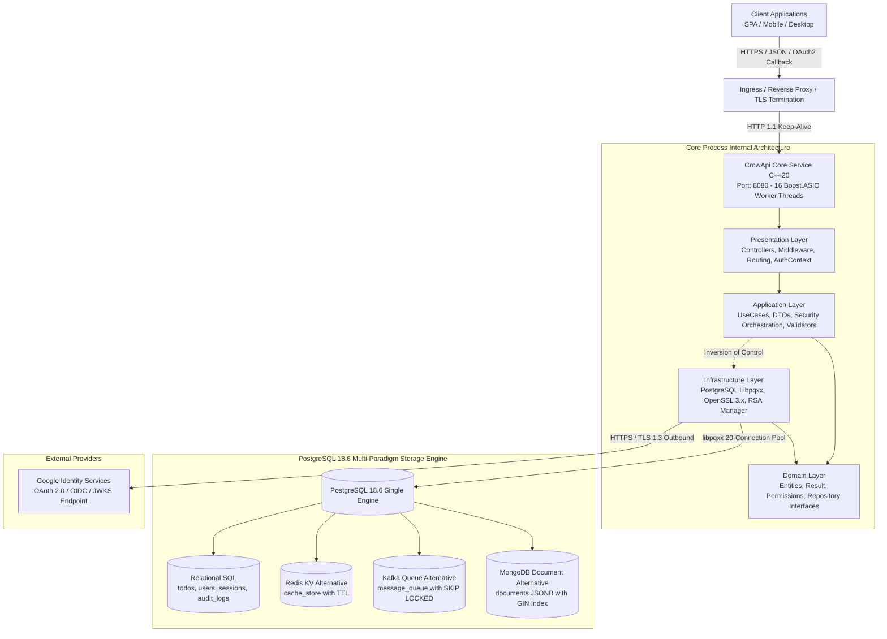

# CrowApi System & Architecture Documentation

Welcome to the comprehensive technical documentation for **CrowApi**, an enterprise-grade REST API backend built in **Modern ISO C++20**, powered by the **Crow Microframework**, **OpenSSL 3.x**, and a **PostgreSQL 18.6 Multi-Paradigm Data Engine**.

---

## Documentation Structure

This documentation suite provides deep technical specifications, architectural diagrams, security analysis, database schemas, API interaction flows, and a rigorous test design strategy.

| Document | Title | Description |
| :--- | :--- | :--- |
| **[01. System Design](01_system_design.md)** | **High-Level System Design & Runtime Topologies** | Explains the overarching architecture, thread models (ASIO Reactor), connection pooling, thread-safe OpenSSL crypto, scalability considerations, and container deployment. |
| **[02. Software Architecture](02_architecture.md)** | **Clean Architecture & Module Design** | In-depth breakdown of the 5-layer Clean Architecture (`Domain`, `Application`, `Infrastructure`, `Presentation`, `Core`), Ports & Adapters, and component interactions. |
| **[03. Clean Layer Architecture](clean_architecture.md)** | **Deep Dive into Clean Layers in C++20** | Detailed analysis of each layer, C++20 concepts, compilation firewalls, dependency inversion boundaries, and exception insulation. |
| **[04. Security Architecture](security.md)** | **Security Architecture & Middleware Pipeline** | Threat mitigation matrix, `extractAuthenticatedUser` middleware, RS256 JWT key rotation, session rotation, and PostgreSQL `LISTEN/NOTIFY` revocation. |
| **[05. Database Design](03_database_design.md)** | **PostgreSQL 18.6 4-in-1 Multi-Paradigm Engine** | Technical specifications for unifying Relational SQL, Redis Key-Value caching (with TTL), Kafka Queue streaming (`FOR UPDATE SKIP LOCKED`), and MongoDB Document JSONB (`jsonb_path_ops` GIN). Includes schemas, HOT optimization (fillfactor), and indexing strategies. |
| **[06. API & Auth Flows](04_api_flows.md)** | **API Flows, OAuth2 PKCE & Security Sequences** | Step-by-step sequence diagrams and flowcharts for Local Authentication, Google OAuth 2.0 / OIDC with RFC 7636 PKCE S256, Refresh Token Rotation, Session Revocation with PostgreSQL `LISTEN/NOTIFY`, and Multi-Paradigm APIs. |
| **[07. Test Design & Strategy](05_test_design.md)** | **Test Strategy, Scenarios & Cyber-Security Testing** | Comprehensive breakdown of all 68 automated test suites across 14 categories. Explains *why* tests exist, *what* vulnerabilities they guard against (SQLi, XSS, JWT alg:none, token replay, IDOR, brute-force), and *how* they are executed via the zero-dependency test framework. |
| **[08. Setup & Execution Guide](setup_guide.md)** | **Complete Machine Setup, Build & Run Guide** | Step-by-step instructions for Windows, Linux, and macOS: toolchain setup, vcpkg dependencies, Docker PostgreSQL, building, test running, and live API execution. |

---

## High-Level System Architecture At a Glance



---

## Key System Specifications

* **Language**: ISO Modern C++20 (`/std:c++20` on MSVC, `-std=c++20` on GCC/Clang).
* **HTTP Framework**: [Crow C++ Microframework](https://crowcpp.org/) (header-only, modern C++ REST framework built on Boost.ASIO).
* **Database Driver**: [libpqxx 8.x](https://github.com/jtv/libpqxx) (Official C++ client library for PostgreSQL).
* **Database Server**: PostgreSQL 18.6 running in Alpine Linux Docker container.
* **Cryptography Engine**: OpenSSL 3.x (`libcrypto`, `libssl`) implementing:
  * RS256 (RSA 2048-bit with SHA-256) JWT Access Tokens.
  * SHA-256 HMAC & Cryptographic Hashing.
  * PBKDF2-HMAC-SHA256 (100,000 iterations) with CSPRNG 16-byte salt for local passwords.
  * RFC 7636 PKCE S256 (`code_challenge` / `code_verifier`) generation & verification.
  * CSPRNG via `RAND_bytes` for state tokens, refresh tokens, and session identifiers.
* **Build System**: CMake 3.28+ with CMakePresets (`x64-debug`, `x64-release`).
* **Package Management**: Microsoft `vcpkg` in manifest mode (`vcpkg.json`).

---

## Repository Project Structure

```text
CrowApi/
├── CMakeLists.txt                 # Root CMake build configuration
├── CMakePresets.json              # Standardized MSVC / Ninja build presets
├── vcpkg.json                     # Dependency manifests (crow, libpqxx, openssl, nlohmann-json)
├── Dockerfile                     # Multi-stage production build container definition
├── docker-compose.yml             # Local deployment with PostgreSQL 18.6
├── .env                           # Runtime environment configuration (untracked)
├── .env.example                   # Template environment configuration
├── .env.test                      # Isolated test environment configuration
├── migrations/                    # Idempotent PostgreSQL SQL migration scripts
│   ├── 001_init_schema.sql
│   ├── 002_auth_sessions_schema.sql
│   ├── 003_performance_optimizations.sql
│   └── 004_google_auth_schema.sql
├── Domain/                        # Layer 1: Enterprise Business Rules & Entities
│   ├── include/Domain/Common/     # Result<T,E>, Permissions, DomainConcepts
│   ├── include/Domain/Entities/   # User, Session, Todo, CacheEntry, DocumentEntity, QueueMessage
│   └── include/Domain/Repositories/# Repository Interfaces (Ports)
├── Application/                   # Layer 2: Application Business Logic & Orchestration
│   ├── include/Application/DTOs/  # Request / Response Data Transfer Objects
│   ├── include/Application/Security/# Security Interfaces (IJwtService, IKeyManager, IGoogleAuthService)
│   ├── include/Application/UseCases/# Business Use Cases (Auth, Session, Todo, Cache, Queue, Document)
│   └── include/Application/Validation/# Strict Input Validators
├── Infrastructure/                # Layer 3: Frameworks, Drivers, Database & Cryptography
│   ├── include/Infrastructure/Config/# Environment Loader & Config Parsing
│   ├── include/Infrastructure/Persistence/# Postgres Repositories (libpqxx 8.x) & Connection Pool
│   └── include/Infrastructure/Security/# OpenSSL 3.x Crypto, RsaKeyManager, JwtService, GoogleAuthService
├── Presentation/                  # Layer 4: HTTP Delivery, Routing & Controllers
│   ├── include/Presentation/Controllers/# AuthController, SessionController, TodoController, etc.
│   ├── include/Presentation/Middleware/# LoggingMiddleware, AuthContext (Bearer & Claims extraction)
│   └── include/Presentation/Routes/    # Crow URL Route Handlers & HTTP Envelopes
├── Core/                          # Composition Root / Application Entry Point
│   ├── Core.h                     # Dependency Injection Container & Service Wire-up
│   └── Core.cpp                   # main() Entry Point
├── Tests/                         # Comprehensive Zero-Dependency Automated Test Suite
│   ├── include/TestHarness.h      # Custom high-speed unit & integration test framework
│   ├── Unit/                      # Domain, Application, Infrastructure, Presentation Unit Tests
│   ├── Security/                  # Cyber-attack penetration test suite (SQLi, XSS, JWT tampering, Replay)
│   ├── Performance/               # Concurrency & Throughput Benchmarks (Connection pool, RS256, Queue)
│   ├── E2E/                       # End-to-End full-flow API testing
│   └── main.cpp                   # Test Runner CLI with filter support
└── docs/                          # Comprehensive System Documentation
    ├── README.md                  # Documentation Master Index
    ├── 01_system_design.md        # System Design & Concurrency
    ├── 02_architecture.md         # Clean Architecture & Layer Interactions
    ├── 03_database_design.md      # PostgreSQL 18.6 4-in-1 Engine Design
    ├── 04_api_flows.md            # API Sequences & OAuth2 PKCE Flows
    └── 05_test_design.md          # Test Strategy & 68 Scenarios Analysis
```
