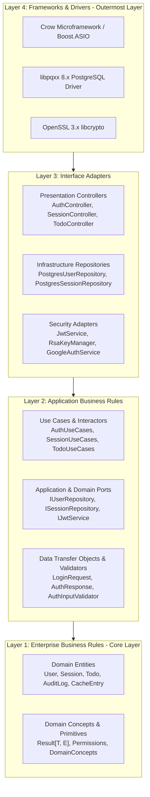
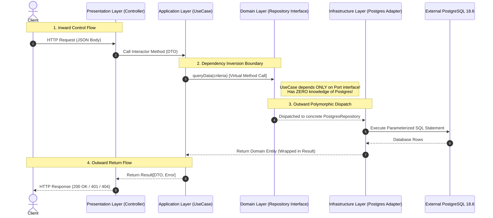

# Clean Layer Architecture Deep Dive

---

## 1. Architectural Vision & Foundational Principles

**CrowApi** is structured according to the **Clean Architecture** paradigm (derived from Robert C. Martin / Hexagonal Architecture / Onion Architecture) tailored specifically for **Modern ISO C++20**.

The core premise is the **Dependency Rule**:
> *Source code dependencies must point strictly inwards, towards higher-level policies. Inner layers have zero knowledge of outer layers, databases, network libraries, or UI frameworks.*



---

## 2. Why Clean Architecture for Modern C++20?

1. **Compilation Firewall & Incremental Build Speeds**: In large C++ codebases, header coupling leads to massive compile times. By decoupling `Domain` and `Application` from external headers (`crow.h`, `pqxx/pqxx`, `openssl/evp.h`), changes to database SQL or HTTP routes only recompile the outermost translation units.
2. **Deterministic Testability (Zero-DB Mocking)**: Business logic in `AuthUseCases` depends only on abstract C++ interfaces (`IUserRepository`, `ISessionRepository`). Unit tests can inject in-memory mock repositories and execute in microseconds without requiring a database.
3. **Framework & Driver Independence**: The HTTP framework (Crow) and the database driver (libpqxx) are low-level implementation details. The application core can be ported to another web server (Drogon, Pistache, Envoy) or another database without changing domain rules.
4. **Memory Safety & Lifetime Clarity**: Ownership semantics are clearly demarcated: `std::shared_ptr` for shared service lifetimes, `std::unique_ptr` for exclusive resources, and `std::string_view` for non-allocating parameters across boundary layers.

---

## 3. Layer-by-Layer Detailed Analysis

### 3.1 Layer 1: Domain Layer (`Domain/`)
The heart of the application containing enterprise-wide business logic, entities, invariants, and repository contracts.

* **Characteristics**:
  * **Zero External Dependencies**: Pure standard C++20 library only.
  * Never imports `<crow.h>`, `<pqxx/pqxx>`, `<nlohmann/json.hpp>`, or OpenSSL.
* **Key Components**:
  * [`User`](file:///e:/Projects/CPP/CrowApi/Domain/include/Domain/Entities/User.h): Encapsulates account status, failed login tracking, lockout window calculations, role assignments, and authentication provider states (`local`, `google`, `local+google`).
  * [`Session`](file:///e:/Projects/CPP/CrowApi/Domain/include/Domain/Entities/Session.h): Encapsulates active session invariants, SHA-256 refresh token hashes, client device metadata, and sliding expiration boundaries.
  * [`Result<T, E>`](file:///e:/Projects/CPP/CrowApi/Domain/include/Domain/Common/Result.h): Functional Railway-Oriented error type eliminating expensive C++ exception unwinding in business logic.
  * [`DomainConcepts.h`](file:///e:/Projects/CPP/CrowApi/Domain/include/Domain/Common/DomainConcepts.h): C++20 concepts (`template <typename T> concept Entity = ...`) enforcing compile-time constraints on domain entities.
  * **Repository Ports**: Pure virtual interfaces (`IUserRepository`, `ISessionRepository`, `ITodoRepository`, `ICacheRepository`, `IMessageQueueRepository`, `IDocumentRepository`, `IAuditLogRepository`).

```cpp
// Example: Domain Entity Invariant Method
bool User::isLockedOut() const noexcept {
    if (failedLoginAttempts < 5 || !lockedUntil.has_value()) {
        return false;
    }
    return std::chrono::system_clock::now() < *lockedUntil;
}
```

---

### 3.2 Layer 2: Application Layer (`Application/`)
Coordinates application activities and directs domain entities to fulfill use case scenarios.

* **Characteristics**:
  * Depends **strictly on `Domain`**.
  * Contains no knowledge of HTTP status codes, JSON wire protocols, or database SQL dialects.
* **Key Components**:
  * **Use Cases (Interactors)**:
    * [`AuthUseCases`](file:///e:/Projects/CPP/CrowApi/Application/include/Application/UseCases/AuthUseCases.h): Orchestrates user registration, local login, Google OAuth PKCE verification, password setting, and token refresh rotation.
    * [`SessionUseCases`](file:///e:/Projects/CPP/CrowApi/Application/include/Application/UseCases/SessionUseCases.h): Orchestrates session queries, device logout, and admin revocation.
    * [`TodoUseCases`](file:///e:/Projects/CPP/CrowApi/Application/include/Application/UseCases/TodoUseCases.h), [`CacheUseCases`](file:///e:/Projects/CPP/CrowApi/Application/include/Application/UseCases/CacheUseCases.h), [`QueueUseCases`](file:///e:/Projects/CPP/CrowApi/Application/include/Application/UseCases/QueueUseCases.h), [`DocumentUseCases`](file:///e:/Projects/CPP/CrowApi/Application/include/Application/UseCases/DocumentUseCases.h).
  * **Data Transfer Objects (DTOs)**:
    * Decoupled plain structs (`LoginRequest`, `RegisterRequest`, `GoogleLoginRequest`, `AuthResponse`) preventing wire formats from leaking into domain models.
  * **Input Validators**:
    * [`AuthInputValidator`](file:///e:/Projects/CPP/CrowApi/Application/include/Application/Validation/AuthInputValidator.h): Validates RFC 5322 email syntax, password entropy, and field lengths before execution.
  * **Security Ports**:
    * Abstract interfaces for security services: [`IJwtService`](file:///e:/Projects/CPP/CrowApi/Application/include/Application/Security/IJwtService.h), [`IKeyManager`](file:///e:/Projects/CPP/CrowApi/Application/include/Application/Security/IKeyManager.h), [`IPasswordHasher`](file:///e:/Projects/CPP/CrowApi/Application/include/Application/Security/IPasswordHasher.h), [`IGoogleAuthService`](file:///e:/Projects/CPP/CrowApi/Application/include/Application/Security/IGoogleAuthService.h).

---

### 3.3 Layer 3: Infrastructure Layer (`Infrastructure/`)
Adapts low-level external systems, database drivers, operating system services, and cryptographic libraries to satisfy Domain and Application interfaces.

* **Characteristics**:
  * Depends on `Domain` and `Application` to implement their abstract ports.
  * Directly links external third-party SDKs: `libpqxx` (PostgreSQL 18.6), `libcrypto` / `libssl` (OpenSSL 3.x).
* **Key Components**:
  * **Persistence Adapters**:
    * [`PostgresDb`](file:///e:/Projects/CPP/CrowApi/Infrastructure/include/Infrastructure/Persistence/PostgresDb.h): Thread-safe connection pool with RAII leasing.
    * [`PostgresUserRepository`](file:///e:/Projects/CPP/CrowApi/Infrastructure/include/Infrastructure/Persistence/PostgresUserRepository.h): Implements `IUserRepository` via parameterized SQL.
    * [`PostgresSessionRepository`](file:///e:/Projects/CPP/CrowApi/Infrastructure/include/Infrastructure/Persistence/PostgresSessionRepository.h): Implements `ISessionRepository`.
    * [`PostgresCacheRepository`](file:///e:/Projects/CPP/CrowApi/Infrastructure/include/Infrastructure/Persistence/PostgresCacheRepository.h), [`PostgresMessageQueueRepository`](file:///e:/Projects/CPP/CrowApi/Infrastructure/include/Infrastructure/Persistence/PostgresMessageQueueRepository.h), [`PostgresDocumentRepository`](file:///e:/Projects/CPP/CrowApi/Infrastructure/include/Infrastructure/Persistence/PostgresDocumentRepository.h).
    * [`PostgresSessionRevocationListener`](file:///e:/Projects/CPP/CrowApi/Infrastructure/include/Infrastructure/Persistence/PostgresSessionRevocationListener.h): Background worker thread running PostgreSQL `LISTEN session_revoked`.
  * **Security Adapters**:
    * [`OpenSslCrypto`](file:///e:/Projects/CPP/CrowApi/Infrastructure/include/Infrastructure/Security/OpenSslCrypto.h): Implements PBKDF2-HMAC-SHA256, SHA-256, and CSPRNG.
    * [`RsaKeyManager`](file:///e:/Projects/CPP/CrowApi/Infrastructure/include/Infrastructure/Security/RsaKeyManager.h): Implements `IKeyManager` for 2048-bit RSA key generation and RFC 7517 JWKS export.
    * [`JwtService`](file:///e:/Projects/CPP/CrowApi/Infrastructure/include/Infrastructure/Security/JwtService.h): Implements `IJwtService` for RS256 token encoding and decoding.
    * [`GoogleAuthService`](file:///e:/Projects/CPP/CrowApi/Infrastructure/include/Infrastructure/Security/GoogleAuthService.h): Implements `IGoogleAuthService` for RFC 7636 PKCE and Google token exchange.
  * **Configuration**:
    * [`EnvLoader`](file:///e:/Projects/CPP/CrowApi/Infrastructure/include/Infrastructure/Config/EnvLoader.h): Thread-safe environment file parser.

---

### 3.4 Layer 4: Presentation Layer (`Presentation/`)
Translates incoming HTTP requests into application commands, calls interactors, and formats the output into standard HTTP JSON envelopes.

* **Characteristics**:
  * Depends on `Application` and `Domain`.
  * Integrates the **Crow Microframework** HTTP engine.
* **Key Components**:
  * **Controllers**:
    * [`AuthController`](file:///e:/Projects/CPP/CrowApi/Presentation/include/Presentation/Controllers/AuthController.h): Routes `/api/v1/auth/*` requests.
    * [`SessionController`](file:///e:/Projects/CPP/CrowApi/Presentation/include/Presentation/Controllers/SessionController.h) & [`AdminSessionController`](file:///e:/Projects/CPP/CrowApi/Presentation/include/Presentation/Controllers/AdminSessionController.h).
    * [`TodoController`](file:///e:/Projects/CPP/CrowApi/Presentation/include/Presentation/Controllers/TodoController.h), [`CacheController`](file:///e:/Projects/CPP/CrowApi/Presentation/include/Presentation/Controllers/CacheController.h), [`QueueController`](file:///e:/Projects/CPP/CrowApi/Presentation/include/Presentation/Controllers/QueueController.h), [`DocumentController`](file:///e:/Projects/CPP/CrowApi/Presentation/include/Presentation/Controllers/DocumentController.h).
  * **Middleware**:
    * [`LoggingMiddleware`](file:///e:/Projects/CPP/CrowApi/Presentation/include/Presentation/Middleware/LoggingMiddleware.h): Tracing and timing.
    * [`AuthContext`](file:///e:/Projects/CPP/CrowApi/Presentation/include/Presentation/Middleware/AuthContext.h): Authenticated user claims context.
  * **HTTP Serialization & Routing**:
    * [`HttpResponseHelper`](file:///e:/Projects/CPP/CrowApi/Presentation/include/Presentation/Common/HttpResponseHelper.h): Envelopes, status mapping, and Bearer token extraction.
    * [`Router`](file:///e:/Projects/CPP/CrowApi/Presentation/include/Presentation/Routes/Router.h): Endpoint registration table.

---

### 3.5 Layer 5: Core Layer (`Core/` - Composition Root)
The single location in the entire solution where concrete types are instantiated and dependency injection is wired up.

* **Responsibilities**:
  * Loads `.env` configuration via `EnvLoader`.
  * Initializes the `PostgresDb` connection pool.
  * Instantiates concrete repositories (`PostgresUserRepository`, `PostgresSessionRepository`).
  * Instantiates security adapters (`RsaKeyManager`, `JwtService`, `GoogleAuthService`).
  * Injects infrastructure instances into Application Use Cases.
  * Injects use cases into Presentation Controllers.
  * Configures Crow app routing, thread pool size (16 worker threads), and starts the Boost.ASIO event loop.

---

## 4. Control Flow vs Dependency Inversion Flow

Notice how the **runtime control flow** moves from outside to inside and back out, while the **source code dependency** at the boundary is inverted:



---

## 5. Architectural Invariants Enforced in CrowApi

1. **No Domain Leakage**: Domain entities never contain JSON serialization annotations or Crow HTTP constructs.
2. **Strict Repository Boundary**: Database SQL statements are strictly confined to `Infrastructure/src/Persistence/`. No controller or use case ever writes raw SQL queries.
3. **No Dynamic Polymorphic Overhead in Hot Domain Code**: Where runtime polymorphism is not strictly necessary, modern C++20 concepts and templates are used to allow compiler inlining and devirtualization.
4. **Complete Exception Insulation**: Database and network exceptions thrown by external libraries (`pqxx::broken_connection`, `std::runtime_error`) are caught at the infrastructure boundary and converted into deterministic `Domain::Result::err(...)` values.
