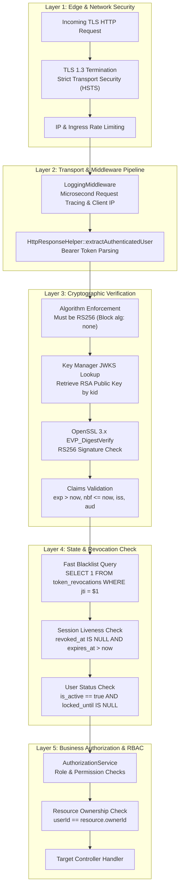
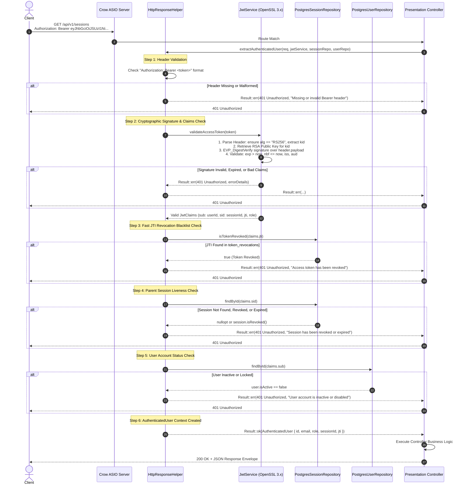
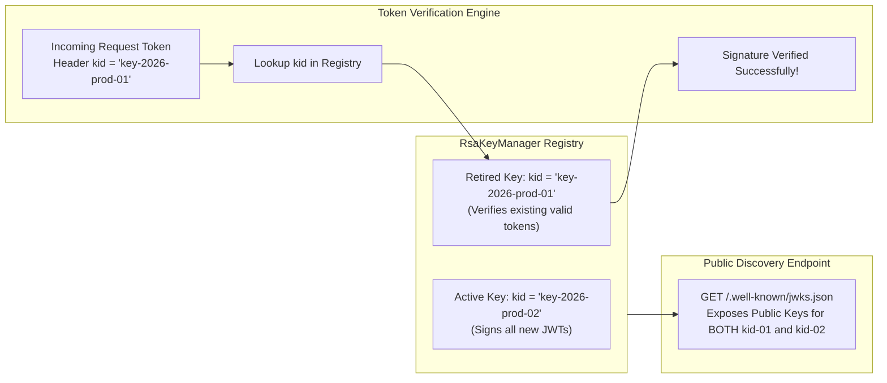
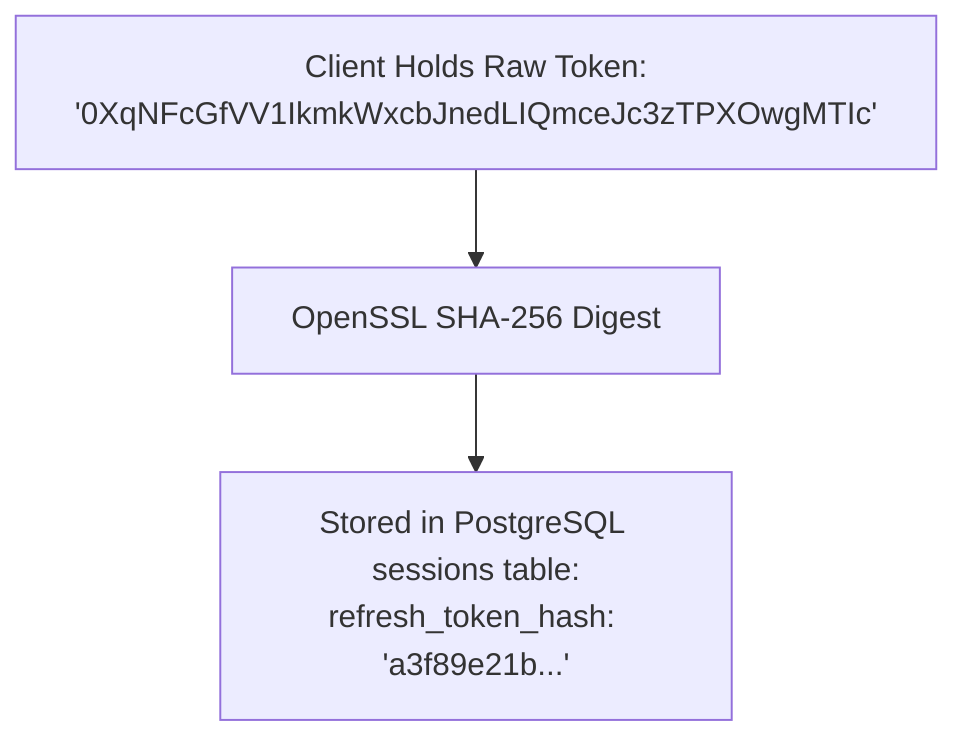
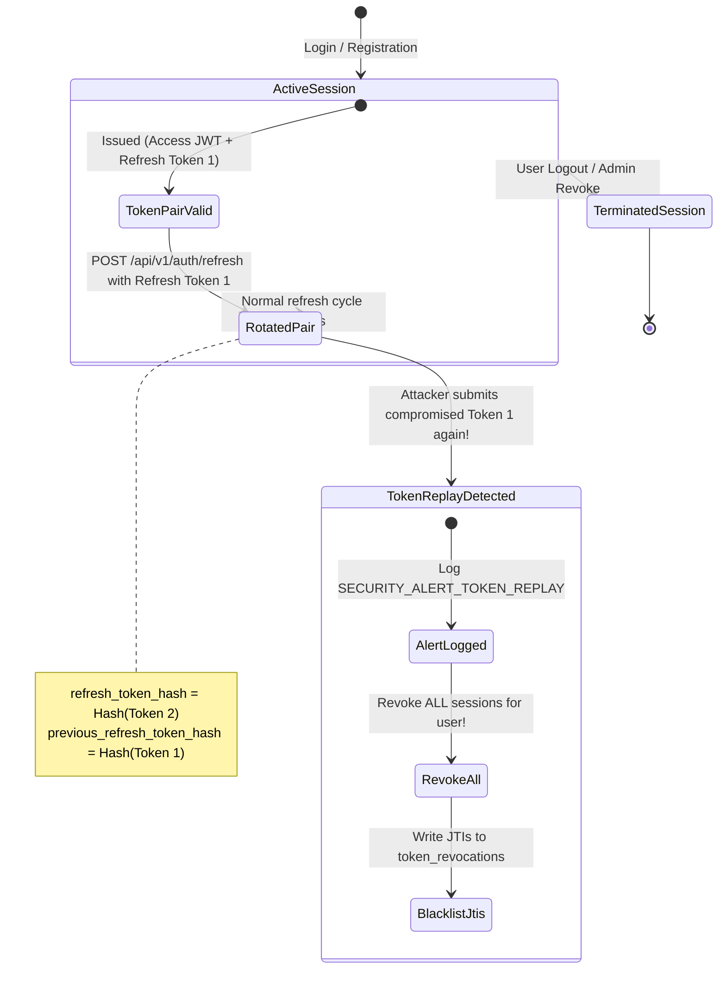
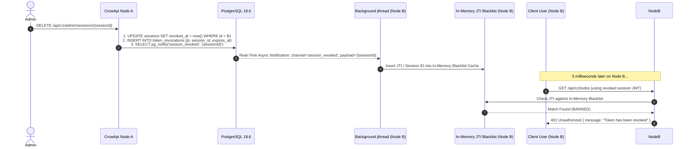

# Security Architecture, Middleware & Threat Defense

---

## 1. Executive Security Summary & Zero-Trust Principles

**CrowApi** is architected on a strict **Zero-Trust Security Model**: *never trust, always verify*. Every incoming HTTP request must prove its authenticity, integrity, and authorization on every endpoint. No assumption of perimeter security or stateful cookies is made.

### Core Security Guarantees
* **Asymmetric RS256 Cryptography**: All JWT access tokens are signed with 2048-bit RSA private keys; public keys are discoverable via standard RFC 7517 JWKS.
* **RFC 7636 PKCE S256**: All Google OAuth flows enforce Proof Key for Code Exchange using cryptographically random verifiers and SHA-256 challenges, verified against official RFC test vectors.
* **Refresh Token Family Revocation**: Refresh tokens rotate on every invocation. If a previously rotated token is presented again (replay attack), the entire family of sessions is immediately revoked.
* **Real-Time JTI Blacklisting**: Instantaneous token revocation across all cluster nodes using PostgreSQL `LISTEN / NOTIFY` on channel `session_revoked`.
* **Zero SQL Injection Surface**: 100% of database queries execute through `pqxx::params` prepared statements.
* **Brute-Force Lockout Defense**: 5 consecutive failed login attempts lock the target account for 15 minutes.

---

## 2. Defense-in-Depth Architecture

The system implements multiple overlapping layers of defense so that if one security control is compromised, subsequent layers prevent exploitation:



---

## 3. Threat Mitigation Matrix

| Vulnerability / Attack Vector | Severity | Mitigating Security Control in CrowApi | Verification Mechanism |
| :--- | :--- | :--- | :--- |
| **SQL Injection (SQLi / CWE-89)** | Critical | 100% parameterized SQL via `pqxx::params`. Zero string concatenation. Input sanitization in validators. | Tested in `Security::CyberAttacks/SqlInjection*` |
| **OAuth Code Interception (RFC 7636)** | High | Mandatory PKCE with `S256` method. 64-char CSPRNG verifier and SHA-256 base64url challenge. | Tested in `Security::PKCE/*` |
| **State Replay Attack (OAuth2)** | High | Single-use CSRF `state` and `code_verifier` cached in `cache_store` with 600s TTL, immediately deleted on callback. | Tested in `Application::UseCases/GoogleLogin*` |
| **JWT Signature Tampering** | Critical | OpenSSL 3.x RSA 2048-bit digital signature. Modifying 1 bit invalidates verification. | Tested in `Security::CyberAttacks/JwtSignatureTamperingRejected` |
| **Algorithm Confusion (alg: none / CWE-327)** | Critical | `JwtService` hardcodes check `header.alg == "RS256"`. Any other algorithm is rejected immediately. | Tested in `Security::CyberAttacks/JwtAlgNoneVulnerabilityBlocked` |
| **Key Injection / Unknown `kid`** | High | `RsaKeyManager` only validates against keys present in its internal key registry. Unknown `kid` fails immediately. | Tested in `Security::CyberAttacks/JwtUnknownKeyIdRejected` |
| **Revoked Token Replay** | High | `token_revocations` table and in-memory blacklist reject revoked JTIs with 401 Unauthorized. | Tested in `Security::CyberAttacks/BannedJtiTokenBlockedImmediately` |
| **Refresh Token Theft & Reuse** | High | Token rotation stores SHA-256 hash. Presenting `previous_refresh_token_hash` revokes entire session family. | Tested in `Security::CyberAttacks/RefreshTokenReplayDetected*` |
| **Insecure Direct Object References (IDOR)** | Medium | `AuthorizationService` and controllers strictly compare resource owner UUID against token's `sub`. | Tested in `Security::CyberAttacks/IdorAuthorizationBypassBlocked` |
| **Credential Stuffing / Brute-Force** | Medium | Failed attempt counter. 5 consecutive failures triggers 15-minute account lock (`locked_until`). | Tested in `Security::CyberAttacks/BruteForceTriggersAccountLockout` |
| **Cross-Site Scripting (XSS / CWE-79)** | Medium | Pure JSON API. No HTML rendering. String inputs treated as literal data. | Tested in `Security::CyberAttacks/XssPayloadsHandledAsLiteralStrings` |
| **Buffer Overrun / Corrupt Input** | High | Modern C++20 `std::string`, `std::string_view`, bounds-checked base64 decoding. | Tested in `Security::CyberAttacks/MalformedBase64DoesNotCrash` |

---

## 4. Security Middleware & Authentication Pipeline

Protected endpoints do not read credentials directly. Instead, they execute through the centralized security middleware pipeline implemented in `HttpResponseHelper::extractAuthenticatedUser`:



---

## 5. JWT Architecture & Cryptographic Lifecycle

### 5.1 Token Anatomy (RS256)
Every issued access token consists of three Base64URL-encoded segments:

```text
eyJhbGciOiJSUzI1NiIsInR5cCI6IkpXVCIsImtpZCI6ImtleS0yMDI2LXByb2QtMDEifQ
.
eyJpc3MiOiJjcm93LWFwaS1hdXRoIiwiYXVkIjoiY3J3LWFwaS1jbGllbnRzIiwic3ViIjoiZWJmZWU5MWEtYTQ0OC00YWE4LTgwYjctMDIyZTU2NmM3MDVkIiwic2lkIjoiOTdjM2YzNGYtYzk4Zi00MTE1LTkzZTctNmVmYTM0OWY5YzQ0IiwianRpIjoiY2FhYjc0YTQtNjMwYi00NjA2LWE2MGMtYjY1ZDE5ZDhiYTM0Iiwicm9sZSI6InVzZXIiLCJpYXQiOjE3ODg1OTE0ODQsImV4cCI6MTc4ODU5MjM4NCwibmJmIjoxNzg4NTkxNDg0fQ
.
DLZsXYfvOh2ZRB81615FHDxzxKicpMQ5Llmo8oN1stLaucpPrOlVVOVgOiUOT...
```

1. **Header**:
   * `alg`: Strictly `"RS256"` (RSA Signature with SHA-256).
   * `typ`: `"JWT"`.
   * `kid`: Key ID referencing the specific signing key in the JWKS (e.g. `"key-2026-prod-01"`).
2. **Payload (Claims)**:
   * `iss`: Issuer (`"crow-api-auth"`).
   * `aud`: Audience (`"crow-api-clients"`).
   * `sub`: User ID (UUID string).
   * `sid`: Associated Session ID in PostgreSQL `sessions` table (UUID string).
   * `jti`: Unique JWT ID for tracking and instant blacklisting (UUID string).
   * `role`: User role (`"user"`, `"admin"`, `"superadmin"`).
   * `iat`: Issued At timestamp (Unix epoch seconds).
   * `exp`: Expiration timestamp (15 minutes from issue).
   * `nbf`: Not Before timestamp (Unix epoch seconds).
3. **Signature**:
   * Cryptographic signature computed via OpenSSL 3.x `EVP_DigestSign` using the 2048-bit RSA private key over `ASCII(Header) || '.' || ASCII(Payload)`.

### 5.2 Seamless RSA Key Rotation (Zero Downtime)
Key compromise or scheduled rotation does not invalidate active user sessions:



---

## 6. Multi-Session Management & Refresh Token Security

### 6.1 Database Session Storage & Cryptographic Hashing
Plain refresh tokens are **never stored in the database**. The system only stores SHA-256 cryptographic hashes:



If the database is leaked or dumped, an attacker **cannot authenticate** because SHA-256 is mathematically irreversible.

### 6.2 Refresh Token Rotation State Machine
Every token refresh operation cycles the tokens:



---

## 7. Cross-Component Interactions: DB, Cache & Real-Time Events

### 7.1 PostgreSQL `LISTEN / NOTIFY` Distributed Revocation Architecture

In distributed or clustered deployments, session revocation on Node A must instantly invalidate tokens on Node B without hitting the database on every subsequent request:



---

## 8. Summary of Hardened Security Defenses

1. **RFC 7636 PKCE S256**: All Google OAuth flows enforce Proof Key for Code Exchange using cryptographically random verifiers and SHA-256 challenges.
2. **Replay Attack Defenses**: Refresh tokens use hash rotation (`refresh_token_hash` and `previous_refresh_token_hash`). If an expired or already rotated token is replayed, the entire session family is automatically revoked.
3. **Database Fault Recovery**: If the PostgreSQL container restarts, the connection pool detects connection failures, flushes stale file descriptors, and reconnects without crashing the web service.
4. **Rate Limiting & Account Protection**: 5 consecutive failed login attempts automatically lock the user account for 15 minutes (`locked_until`), guarding against brute-force password discovery.
5. **No plain tokens on disk**: Passwords hashed with PBKDF2 (100k rounds, 16-byte salt), refresh tokens hashed with SHA-256.
6. **Strict ISO C++20 Memory Safety**: Zero manual `new`/`delete`; all lifetimes managed by RAII (`std::shared_ptr`, `std::unique_ptr`, `pqxx::work`, `EVP_PKEY_free`).
